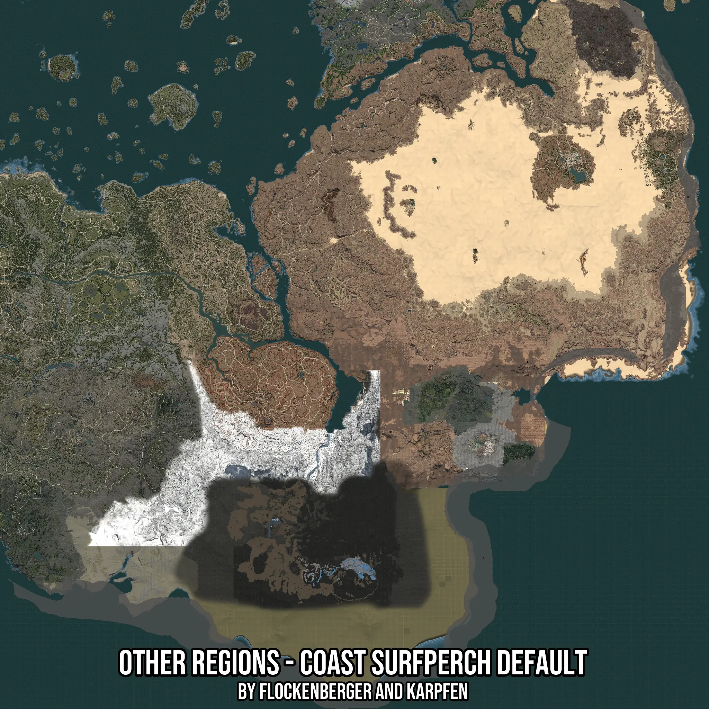

# Other Regions - Coast Surfperch Default
Created by **flockenberger**

- **Red Points**: Exact in-game waypoints.
- **Colored Areas**: Entire area where the fishing table is consistent.
## ⚠️ Info about your float:
To verify your fishing position without modifying your files, you can do so [here](https://flockenberger.github.io/bdo-fish-position/).
- Or watch the guide [here](https://youtu.be/t-VXcRoNojk)

## Waypoints
Below you'll find the Copy-Paste ready XML file for this Fishing-Zone.

```xml
	<!--
		Waypoints for: Other Regions - Coast Surfperch Default
		Auto-Generated by: flockenberger
		Preview at: https://github.com/Flockenberger/bdo-fish-waypoints/tree/main/Bookmark/Other%20Regions%20-%20Coast%20Surfperch%20Default
	-->
	<WorldmapBookMark>
		<BookMark BookMarkName="1: Other Regions - Coast Surfperch Default" PosX="839077.7035236359" PosY="0.0" PosZ="-665600.0530719757" />
		<BookMark BookMarkName="2: Other Regions - Coast Surfperch Default" PosX="1284818.8887119293" PosY="-8175.0" PosZ="122277.60939598083" />
		<BookMark BookMarkName="3: Other Regions - Coast Surfperch Default" PosX="1195670.6516742706" PosY="-8175.0" PosZ="485797.61650562286" />
		<BookMark BookMarkName="4: Other Regions - Coast Surfperch Default" PosX="1169769.474697113" PosY="-8175.0" PosZ="528263.4996891022" />
		<BookMark BookMarkName="5: Other Regions - Coast Surfperch Default" PosX="1231811.8288516998" PosY="0.0" PosZ="377976.4379262924" />
	</WorldmapBookMark>
```

## Usage Guide
[](https://youtu.be/W-bWmKdv8K8)

## Previews
     

 