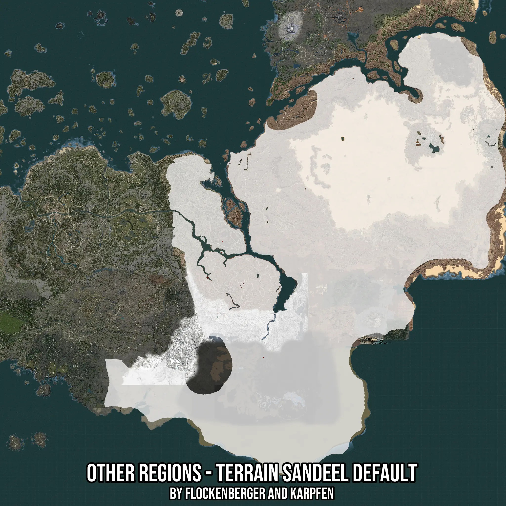

# Other Regions - Terrain Sandeel Default
Created by **flockenberger**

- **Red Points**: Exact in-game waypoints.
- **Colored Areas**: Entire area where the fishing table is consistent.
## ⚠️ Info about your float:
To verify your fishing position without modifying your files, you can do so [here](https://flockenberger.github.io/bdo-fish-position/).
- Or watch the guide [here](https://youtu.be/t-VXcRoNojk)

## Waypoints
Below you'll find the Copy-Paste ready XML file for this Fishing-Zone.

```xml
	<!--
		Waypoints for: Other Regions - Terrain Sandeel Default
		Auto-Generated by: flockenberger
		Preview at: https://github.com/Flockenberger/bdo-fish-waypoints/tree/main/Bookmark/Other%20Regions%20-%20Terrain%20Sandeel%20Default
	-->
	<WorldmapBookMark>
		<BookMark BookMarkName="1: Other Regions - Terrain Sandeel Default" PosX="767698.8785982132" PosY="-8175.0" PosZ="408094.0855741501" />
		<BookMark BookMarkName="2: Other Regions - Terrain Sandeel Default" PosX="321656.51693344116" PosY="0.0" PosZ="-149082.39591121674" />
		<BookMark BookMarkName="3: Other Regions - Terrain Sandeel Default" PosX="318343.5756921768" PosY="0.0" PosZ="-187030.6319475174" />
		<BookMark BookMarkName="4: Other Regions - Terrain Sandeel Default" PosX="271360.04536151886" PosY="0.0" PosZ="-272263.5747909546" />
		<BookMark BookMarkName="5: Other Regions - Terrain Sandeel Default" PosX="460800.0490665436" PosY="0.0" PosZ="-544527.1095275879" />
	</WorldmapBookMark>
```

## Usage Guide
[](https://youtu.be/W-bWmKdv8K8)

## Previews
     

 