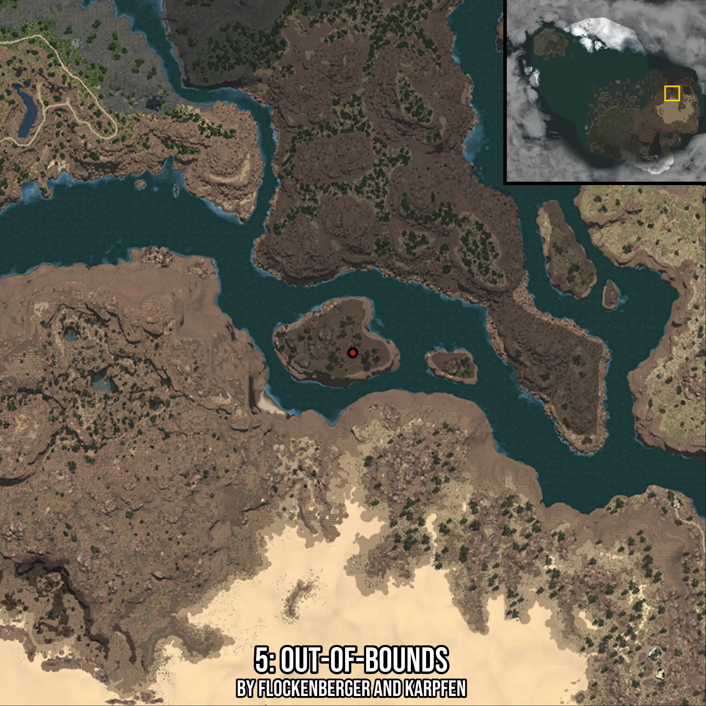
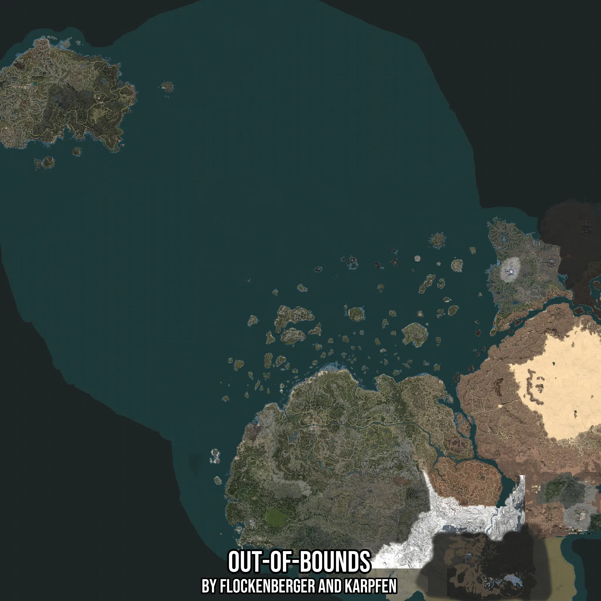

# Out-Of-Bounds
Created by **flockenberger**

- **Red Points**: Exact in-game waypoints.
- **Colored Areas**: Entire area where the fishing table is consistent.
## ⚠️ Info about your float:
To verify your fishing position without modifying your files, you can do so [here](https://flockenberger.github.io/bdo-fish-position/).
- Or watch the guide [here](https://youtu.be/t-VXcRoNojk)

## Waypoints
Below you'll find the Copy-Paste ready XML file for this Fishing-Zone.

```xml
	<!--
		Waypoints for: Out-Of-Bounds
		Auto-Generated by: flockenberger
		Preview at: https://github.com/Flockenberger/bdo-fish-waypoints/tree/main/Bookmark/Out-Of-Bounds
	-->
	<WorldmapBookMark>
		<BookMark BookMarkName="1: Out-Of-Bounds" PosX="-790287.0342254639" PosY="-8175.0" PosZ="-836969.4681882858" />
		<BookMark BookMarkName="2: Out-Of-Bounds" PosX="1118569.473695755" PosY="-8175.0" PosZ="583981.1478376389" />
		<BookMark BookMarkName="3: Out-Of-Bounds" PosX="1250785.9468698502" PosY="-8175.0" PosZ="557477.6179075241" />
		<BookMark BookMarkName="4: Out-Of-Bounds" PosX="904131.8224430084" PosY="-8175.0" PosZ="534287.0292186737" />
		<BookMark BookMarkName="5: Out-Of-Bounds" PosX="842390.6447649002" PosY="-8175.0" PosZ="415623.4974861145" />
	</WorldmapBookMark>
```

## Usage Guide
[](https://youtu.be/W-bWmKdv8K8)

## Previews
     

 