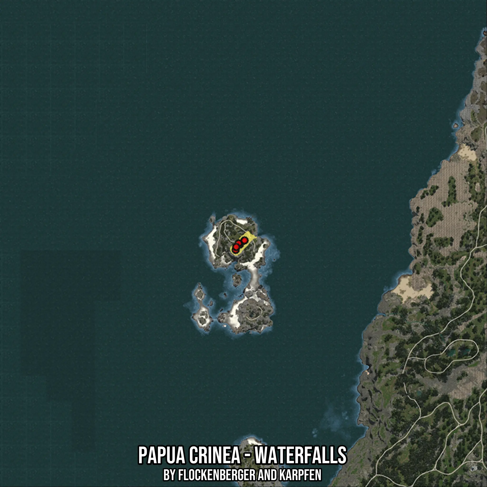

# Papua Crinea - Waterfalls
Created by **flockenberger**

- **Red Points**: Exact in-game waypoints.
- **Colored Areas**: Entire area where the fishing table is consistent.
## ⚠️ Info about your float:
To verify your fishing position without modifying your files, you can do so [here](https://flockenberger.github.io/bdo-fish-position/).
- Or watch the guide [here](https://youtu.be/t-VXcRoNojk)

## Waypoints
Below you'll find the Copy-Paste ready XML file for this Fishing-Zone.

```xml
	<!--
		Waypoints for: Papua Crinea - Waterfalls
		Auto-Generated by: flockenberger
		Preview at: https://github.com/Flockenberger/bdo-fish-waypoints/tree/main/Bookmark/Papua%20Crinea%20-%20Waterfalls
	-->
	<WorldmapBookMark>
		<BookMark BookMarkName="1: Papua Crinea - Waterfalls" PosX="-655661.1492395401" PosY="-8175.0" PosZ="-163538.86678218842" />
		<BookMark BookMarkName="2: Papua Crinea - Waterfalls" PosX="-657769.3845748901" PosY="-8175.0" PosZ="-166249.4550704956" />
		<BookMark BookMarkName="3: Papua Crinea - Waterfalls" PosX="-656263.5021924973" PosY="-8175.0" PosZ="-162936.51382923126" />
		<BookMark BookMarkName="4: Papua Crinea - Waterfalls" PosX="-653251.7374277115" PosY="-8175.0" PosZ="-161430.63144683838" />
		<BookMark BookMarkName="5: Papua Crinea - Waterfalls" PosX="-657468.2080984116" PosY="-8175.0" PosZ="-164743.57268810272" />
	</WorldmapBookMark>
```

## Usage Guide
[](https://youtu.be/W-bWmKdv8K8)

## Previews
     

 