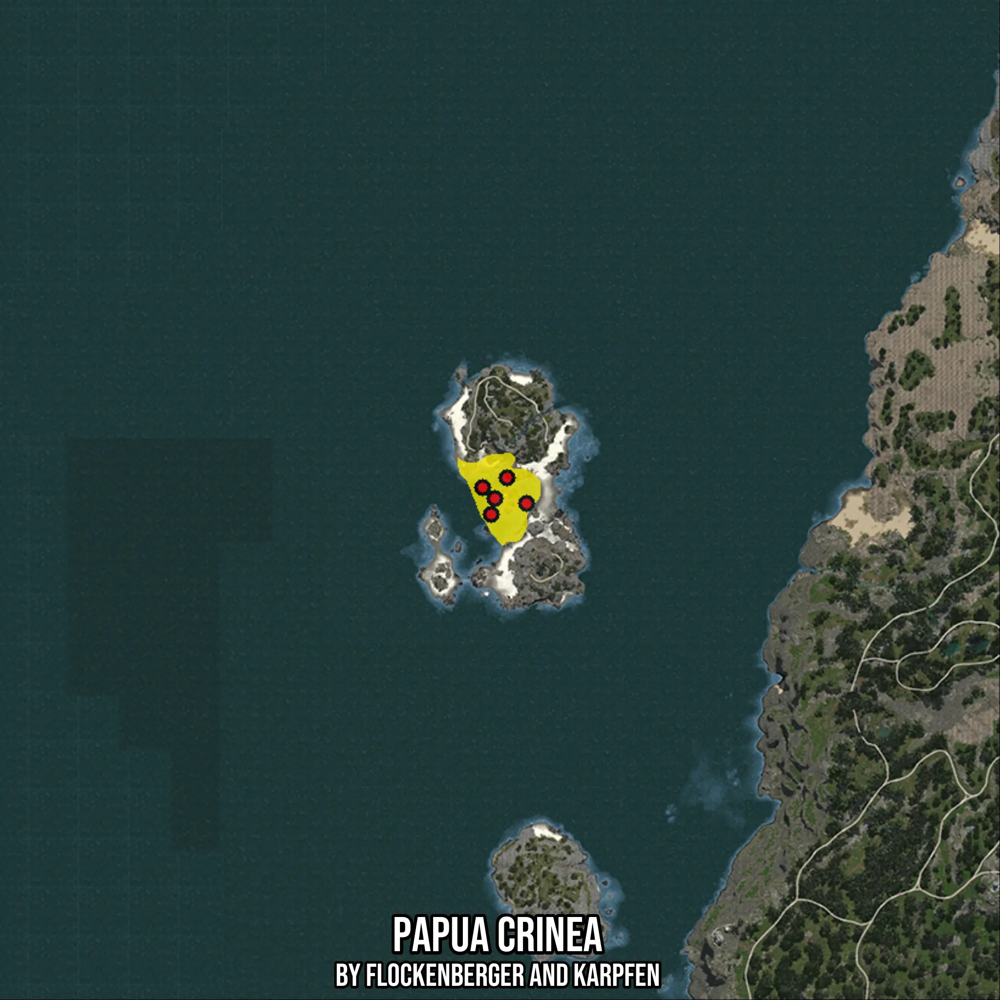

# Papua Crinea
Created by **flockenberger**

- **Red Points**: Exact in-game waypoints.
- **Colored Areas**: Entire area where the fishing table is consistent.
## ⚠️ Info about your float:
To verify your fishing position without modifying your files, you can do so [here](https://flockenberger.github.io/bdo-fish-position/).
- Or watch the guide [here](https://youtu.be/t-VXcRoNojk)

## Waypoints
Below you'll find the Copy-Paste ready XML file for this Fishing-Zone.

```xml
	<!--
		Waypoints for: Papua Crinea
		Auto-Generated by: flockenberger
		Preview at: https://github.com/Flockenberger/bdo-fish-waypoints/tree/main/Bookmark/Papua%20Crinea
	-->
	<WorldmapBookMark>
		<BookMark BookMarkName="1: Papua Crinea" PosX="-661082.3258161545" PosY="-8175.0" PosZ="-181308.27889442444" />
		<BookMark BookMarkName="2: Papua Crinea" PosX="-653251.7374277115" PosY="-8175.0" PosZ="-182512.98480033875" />
		<BookMark BookMarkName="3: Papua Crinea" PosX="-658070.5610513687" PosY="-8175.0" PosZ="-176188.27879428864" />
		<BookMark BookMarkName="4: Papua Crinea" PosX="-664094.0905809402" PosY="-8175.0" PosZ="-178597.69060611725" />
		<BookMark BookMarkName="5: Papua Crinea" PosX="-661985.8552455902" PosY="-8175.0" PosZ="-185223.57308864594" />
	</WorldmapBookMark>
```

## Usage Guide
[](https://youtu.be/W-bWmKdv8K8)

## Previews
     

 