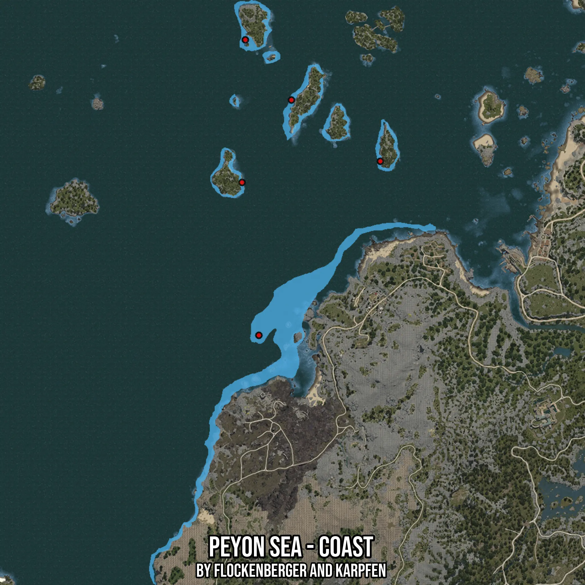

# Peyon Sea - Coast
Created by **flockenberger**

- **Red Points**: Exact in-game waypoints.
- **Colored Areas**: Entire area where the fishing table is consistent.
## ⚠️ Info about your float:
To verify your fishing position without modifying your files, you can do so [here](https://flockenberger.github.io/bdo-fish-position/).
- Or watch the guide [here](https://youtu.be/t-VXcRoNojk)

## Waypoints
Below you'll find the Copy-Paste ready XML file for this Fishing-Zone.

```xml
	<!--
		Waypoints for: Peyon Sea - Coast
		Auto-Generated by: flockenberger
		Preview at: https://github.com/Flockenberger/bdo-fish-waypoints/tree/main/Bookmark/Peyon%20Sea%20-%20Coast
	-->
	<WorldmapBookMark>
		<BookMark BookMarkName="1: Peyon Sea - Coast" PosX="-511096.4405298233" PosY="-8175.0" PosZ="-16263.569784164429" />
		<BookMark BookMarkName="2: Peyon Sea - Coast" PosX="-493025.8519411087" PosY="-8175.0" PosZ="114447.02100753784" />
		<BookMark BookMarkName="3: Peyon Sea - Coast" PosX="-518625.8524417877" PosY="-8175.0" PosZ="147877.60989665985" />
		<BookMark BookMarkName="4: Peyon Sea - Coast" PosX="-520432.9113006592" PosY="-8175.0" PosZ="68668.19658279419" />
		<BookMark BookMarkName="5: Peyon Sea - Coast" PosX="-443632.90979862213" PosY="-8175.0" PosZ="80414.07916545868" />
	</WorldmapBookMark>
```

## Usage Guide
[](https://youtu.be/W-bWmKdv8K8)

## Previews
     

 