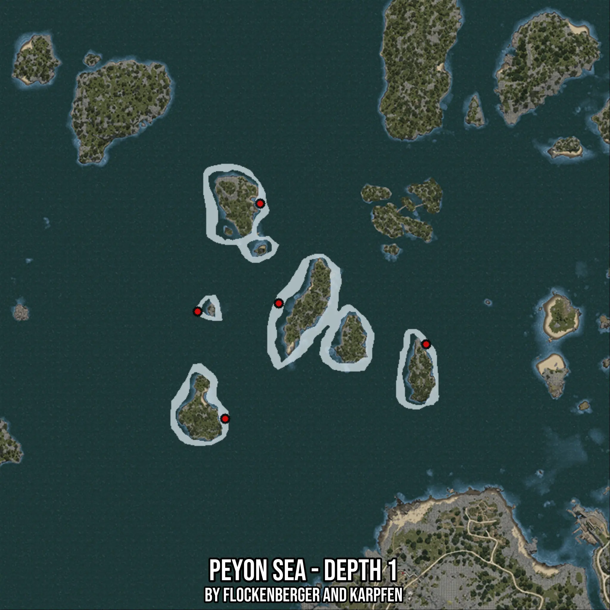

# Peyon Sea - Depth 1
Created by **flockenberger**

- **Red Points**: Exact in-game waypoints.
- **Colored Areas**: Entire area where the fishing table is consistent.
## ⚠️ Info about your float:
To verify your fishing position without modifying your files, you can do so [here](https://flockenberger.github.io/bdo-fish-position/).
- Or watch the guide [here](https://youtu.be/t-VXcRoNojk)

## Waypoints
Below you'll find the Copy-Paste ready XML file for this Fishing-Zone.

```xml
	<!--
		Waypoints for: Peyon Sea - Depth 1
		Auto-Generated by: flockenberger
		Preview at: https://github.com/Flockenberger/bdo-fish-waypoints/tree/main/Bookmark/Peyon%20Sea%20-%20Depth%201
	-->
	<WorldmapBookMark>
		<BookMark BookMarkName="1: Peyon Sea - Depth 1" PosX="-496338.79318237305" PosY="-8175.0" PosZ="115952.90338993073" />
		<BookMark BookMarkName="2: Peyon Sea - Depth 1" PosX="-503868.20509433746" PosY="-8175.0" PosZ="156310.55123806" />
		<BookMark BookMarkName="3: Peyon Sea - Depth 1" PosX="-518023.49948883057" PosY="-8175.0" PosZ="69270.54953575134" />
		<BookMark BookMarkName="4: Peyon Sea - Depth 1" PosX="-436705.85083961487" PosY="-8175.0" PosZ="99388.19718360901" />
		<BookMark BookMarkName="5: Peyon Sea - Depth 1" PosX="-529167.0291185379" PosY="-8175.0" PosZ="112639.96214866638" />
	</WorldmapBookMark>
```

## Usage Guide
[](https://youtu.be/W-bWmKdv8K8)

## Previews
     

 