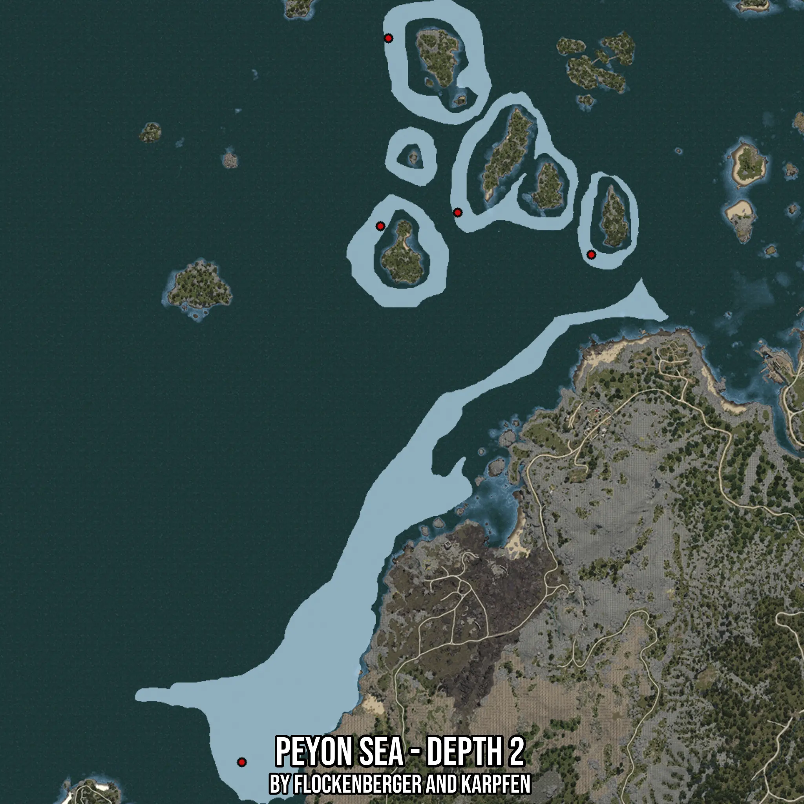

# Peyon Sea - Depth 2
Created by **flockenberger**

- **Red Points**: Exact in-game waypoints.
- **Colored Areas**: Entire area where the fishing table is consistent.
## ⚠️ Info about your float:
To verify your fishing position without modifying your files, you can do so [here](https://flockenberger.github.io/bdo-fish-position/).
- Or watch the guide [here](https://youtu.be/t-VXcRoNojk)

## Waypoints
Below you'll find the Copy-Paste ready XML file for this Fishing-Zone.

```xml
	<!--
		Waypoints for: Peyon Sea - Depth 2
		Auto-Generated by: flockenberger
		Preview at: https://github.com/Flockenberger/bdo-fish-waypoints/tree/main/Bookmark/Peyon%20Sea%20-%20Depth%202
	-->
	<WorldmapBookMark>
		<BookMark BookMarkName="1: Peyon Sea - Depth 2" PosX="-595727.0304203033" PosY="-8175.0" PosZ="-141251.80752277374" />
		<BookMark BookMarkName="2: Peyon Sea - Depth 2" PosX="-533985.8527421951" PosY="-8175.0" PosZ="163839.9631500244" />
		<BookMark BookMarkName="3: Peyon Sea - Depth 2" PosX="-504771.7345237732" PosY="-8175.0" PosZ="90352.90288925171" />
		<BookMark BookMarkName="4: Peyon Sea - Depth 2" PosX="-537298.7939834595" PosY="-8175.0" PosZ="84630.54983615875" />
		<BookMark BookMarkName="5: Peyon Sea - Depth 2" PosX="-448451.73342227936" PosY="-8175.0" PosZ="72583.49077701569" />
	</WorldmapBookMark>
```

## Usage Guide
[](https://youtu.be/W-bWmKdv8K8)

## Previews
     

 