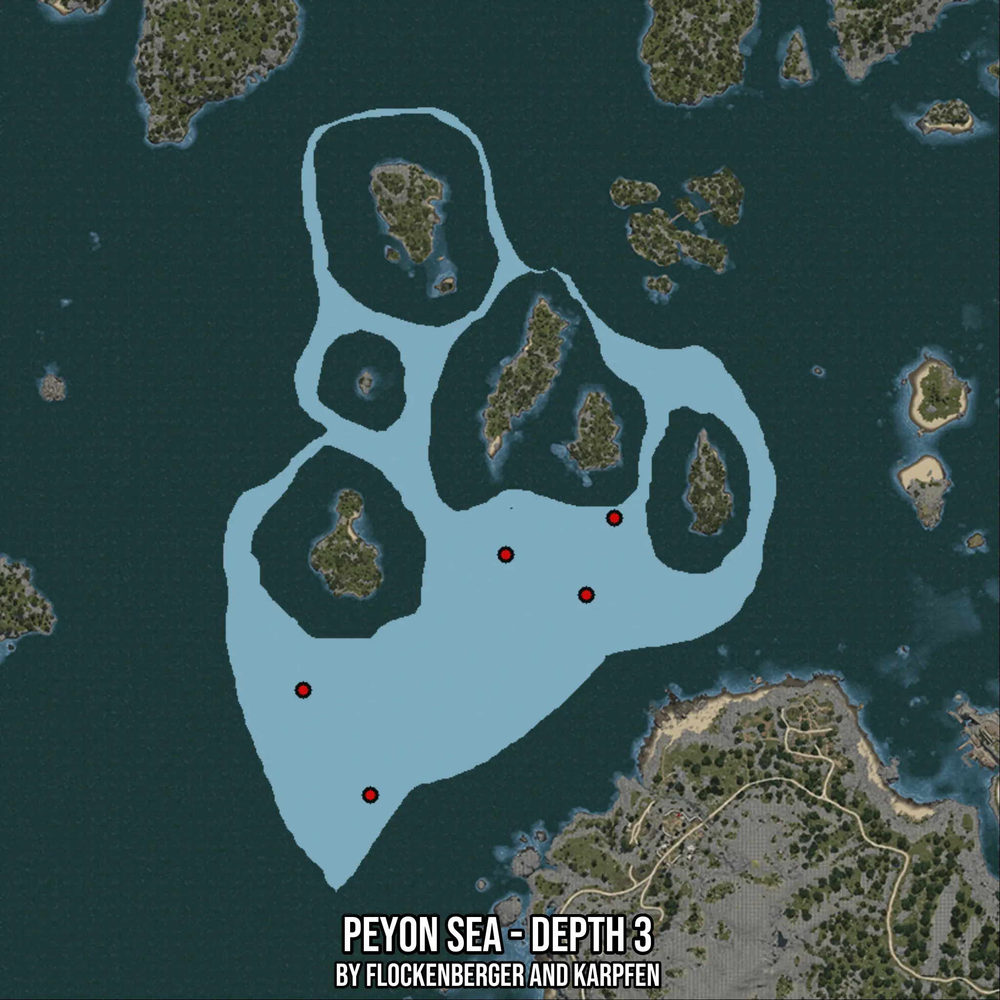

# Peyon Sea - Depth 3
Created by **flockenberger**

- **Red Points**: Exact in-game waypoints.
- **Colored Areas**: Entire area where the fishing table is consistent.
## ⚠️ Info about your float:
To verify your fishing position without modifying your files, you can do so [here](https://flockenberger.github.io/bdo-fish-position/).
- Or watch the guide [here](https://youtu.be/t-VXcRoNojk)

## Waypoints
Below you'll find the Copy-Paste ready XML file for this Fishing-Zone.

```xml
	<!--
		Waypoints for: Peyon Sea - Depth 3
		Auto-Generated by: flockenberger
		Preview at: https://github.com/Flockenberger/bdo-fish-waypoints/tree/main/Bookmark/Peyon%20Sea%20-%20Depth%203
	-->
	<WorldmapBookMark>
		<BookMark BookMarkName="1: Peyon Sea - Depth 3" PosX="-522239.97015953064" PosY="-8175.0" PosZ="11745.8425283432" />
		<BookMark BookMarkName="2: Peyon Sea - Depth 3" PosX="-538804.6763658524" PosY="-8175.0" PosZ="37647.01950550079" />
		<BookMark BookMarkName="3: Peyon Sea - Depth 3" PosX="-488809.38127040863" PosY="-8175.0" PosZ="71077.6083946228" />
		<BookMark BookMarkName="4: Peyon Sea - Depth 3" PosX="-462004.6748638153" PosY="-8175.0" PosZ="80112.9026889801" />
		<BookMark BookMarkName="5: Peyon Sea - Depth 3" PosX="-468931.73382282257" PosY="-8175.0" PosZ="61138.78467082977" />
	</WorldmapBookMark>
```

## Usage Guide
[](https://youtu.be/W-bWmKdv8K8)

## Previews
     

 