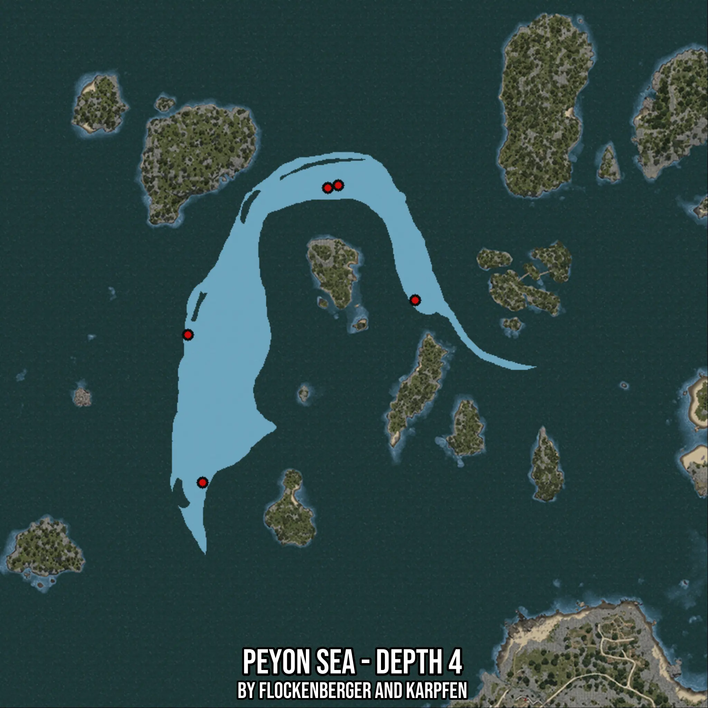

# Peyon Sea - Depth 4
Created by **flockenberger**

- **Red Points**: Exact in-game waypoints.
- **Colored Areas**: Entire area where the fishing table is consistent.
## ⚠️ Info about your float:
To verify your fishing position without modifying your files, you can do so [here](https://flockenberger.github.io/bdo-fish-position/).
- Or watch the guide [here](https://youtu.be/t-VXcRoNojk)

## Waypoints
Below you'll find the Copy-Paste ready XML file for this Fishing-Zone.

```xml
	<!--
		Waypoints for: Peyon Sea - Depth 4
		Auto-Generated by: flockenberger
		Preview at: https://github.com/Flockenberger/bdo-fish-waypoints/tree/main/Bookmark/Peyon%20Sea%20-%20Depth%204
	-->
	<WorldmapBookMark>
		<BookMark BookMarkName="1: Peyon Sea - Depth 4" PosX="-511397.6170063019" PosY="-8175.0" PosZ="186127.0224094391" />
		<BookMark BookMarkName="2: Peyon Sea - Depth 4" PosX="-558682.3238134384" PosY="-8175.0" PosZ="82522.31450080872" />
		<BookMark BookMarkName="3: Peyon Sea - Depth 4" PosX="-515011.7347240448" PosY="-8175.0" PosZ="185223.49298000336" />
		<BookMark BookMarkName="4: Peyon Sea - Depth 4" PosX="-563802.3239135742" PosY="-8175.0" PosZ="134023.49197864532" />
		<BookMark BookMarkName="5: Peyon Sea - Depth 4" PosX="-484592.91059970856" PosY="-8175.0" PosZ="146070.5510377884" />
	</WorldmapBookMark>
```

## Usage Guide
[](https://youtu.be/W-bWmKdv8K8)

## Previews
     

 