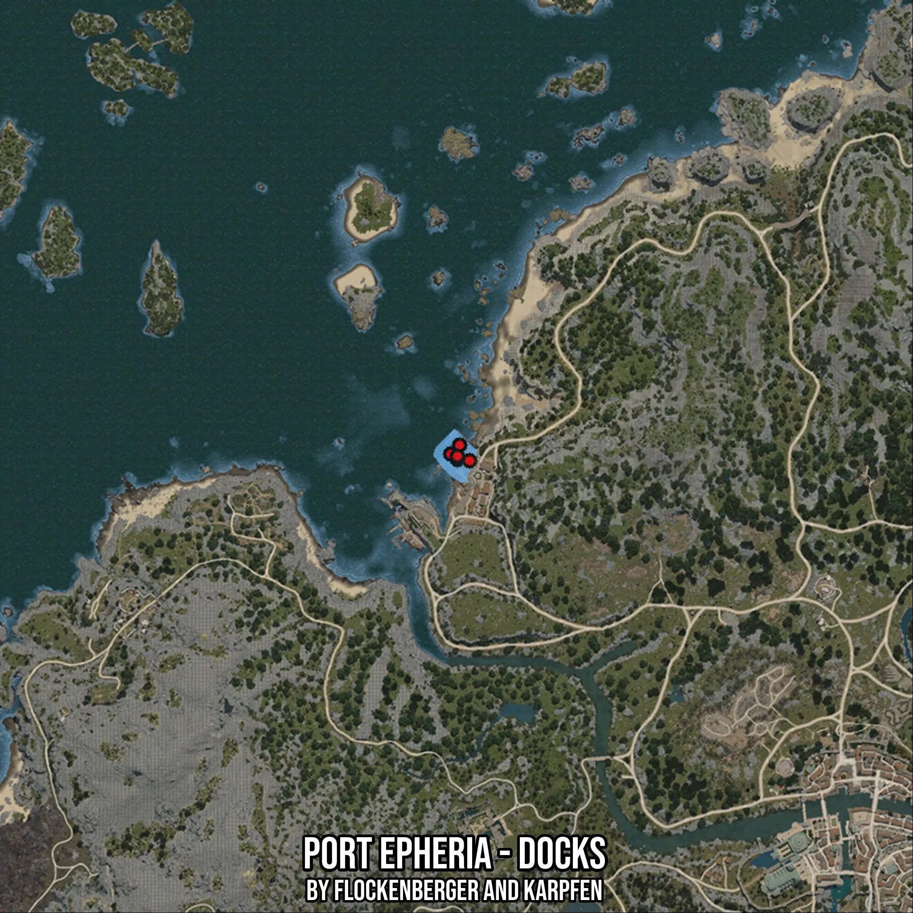

# Port Epheria - Docks
Created by **flockenberger**

- **Red Points**: Exact in-game waypoints.
- **Colored Areas**: Entire area where the fishing table is consistent.
## ⚠️ Info about your float:
To verify your fishing position without modifying your files, you can do so [here](https://flockenberger.github.io/bdo-fish-position/).
- Or watch the guide [here](https://youtu.be/t-VXcRoNojk)

## Waypoints
Below you'll find the Copy-Paste ready XML file for this Fishing-Zone.

```xml
	<!--
		Waypoints for: Port Epheria - Docks
		Auto-Generated by: flockenberger
		Preview at: https://github.com/Flockenberger/bdo-fish-waypoints/tree/main/Bookmark/Port%20Epheria%20-%20Docks
	-->
	<WorldmapBookMark>
		<BookMark BookMarkName="1: Port Epheria - Docks" PosX="-360508.202290535" PosY="-8175.0" PosZ="44272.90198802948" />
		<BookMark BookMarkName="2: Port Epheria - Docks" PosX="-358701.1434316635" PosY="-8175.0" PosZ="42767.0196056366" />
		<BookMark BookMarkName="3: Port Epheria - Docks" PosX="-358098.79047870636" PosY="-8175.0" PosZ="46682.31379985809" />
		<BookMark BookMarkName="4: Port Epheria - Docks" PosX="-358701.1434316635" PosY="-8175.0" PosZ="43670.54903507233" />
		<BookMark BookMarkName="5: Port Epheria - Docks" PosX="-355388.20219039917" PosY="-8175.0" PosZ="42465.84312915802" />
	</WorldmapBookMark>
```

## Usage Guide
[](https://youtu.be/W-bWmKdv8K8)

## Previews
     

 