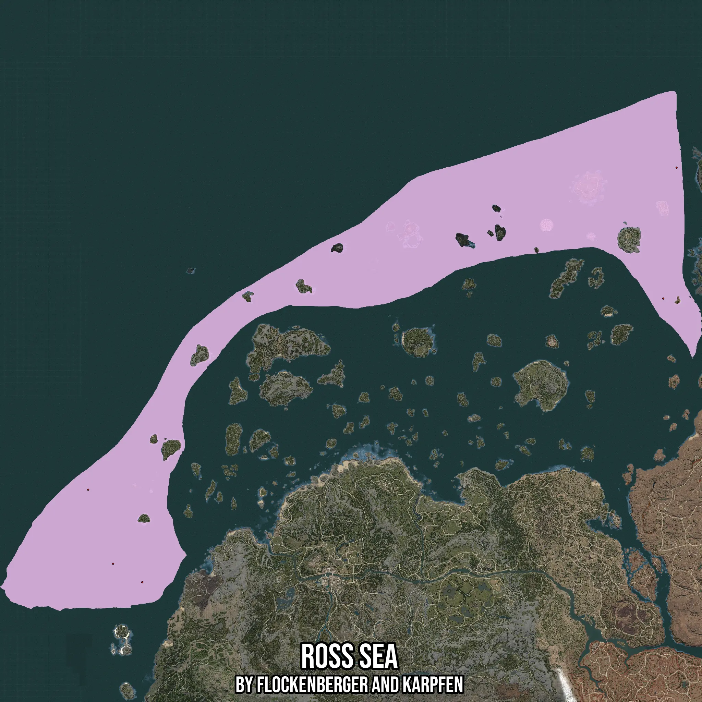

# Ross Sea
Created by **flockenberger**

- **Red Points**: Exact in-game waypoints.
- **Colored Areas**: Entire area where the fishing table is consistent.
## ⚠️ Info about your float:
To verify your fishing position without modifying your files, you can do so [here](https://flockenberger.github.io/bdo-fish-position/).
- Or watch the guide [here](https://youtu.be/t-VXcRoNojk)

## Waypoints
Below you'll find the Copy-Paste ready XML file for this Fishing-Zone.

```xml
	<!--
		Waypoints for: Ross Sea
		Auto-Generated by: flockenberger
		Preview at: https://github.com/Flockenberger/bdo-fish-waypoints/tree/main/Bookmark/Ross%20Sea
	-->
	<WorldmapBookMark>
		<BookMark BookMarkName="1: Ross Sea" PosX="427369.46017742157" PosY="-8175.0" PosZ="745712.9157066345" />
		<BookMark BookMarkName="2: Ross Sea" PosX="401468.283200264" PosY="-8175.0" PosZ="489712.91069984436" />
		<BookMark BookMarkName="3: Ross Sea" PosX="-724028.209400177" PosY="-8175.0" PosZ="115651.72691345215" />
		<BookMark BookMarkName="4: Ross Sea" PosX="-618014.089679718" PosY="-8175.0" PosZ="-65355.335450172424" />
		<BookMark BookMarkName="5: Ross Sea" PosX="-675237.6202106476" PosY="-8175.0" PosZ="-29214.158272743225" />
	</WorldmapBookMark>
```

## Usage Guide
[](https://youtu.be/W-bWmKdv8K8)

## Previews
     

 