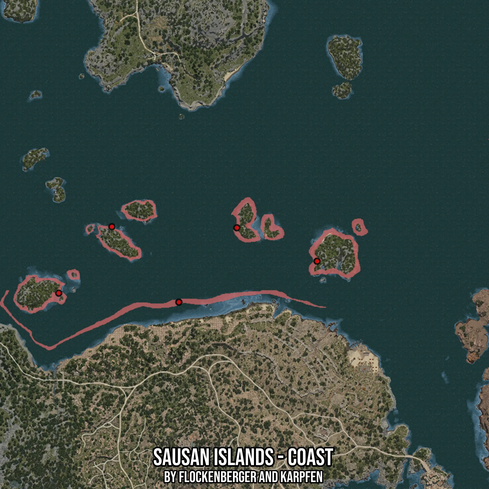

# Sausan Islands - Coast
Created by **flockenberger**

- **Red Points**: Exact in-game waypoints.
- **Colored Areas**: Entire area where the fishing table is consistent.
## ⚠️ Info about your float:
To verify your fishing position without modifying your files, you can do so [here](https://flockenberger.github.io/bdo-fish-position/).
- Or watch the guide [here](https://youtu.be/t-VXcRoNojk)

## Waypoints
Below you'll find the Copy-Paste ready XML file for this Fishing-Zone.

```xml
	<!--
		Waypoints for: Sausan Islands - Coast
		Auto-Generated by: flockenberger
		Preview at: https://github.com/Flockenberger/bdo-fish-waypoints/tree/main/Bookmark/Sausan%20Islands%20-%20Coast
	-->
	<WorldmapBookMark>
		<BookMark BookMarkName="1: Sausan Islands - Coast" PosX="164442.39621162415" PosY="-8175.0" PosZ="158719.9630498886" />
		<BookMark BookMarkName="2: Sausan Islands - Coast" PosX="242748.28009605408" PosY="-8175.0" PosZ="181910.551738739" />
		<BookMark BookMarkName="3: Sausan Islands - Coast" PosX="96376.51252746582" PosY="-8175.0" PosZ="163839.9631500244" />
		<BookMark BookMarkName="4: Sausan Islands - Coast" PosX="197270.632147789" PosY="-8175.0" PosZ="200884.66975688934" />
		<BookMark BookMarkName="5: Sausan Islands - Coast" PosX="126494.16017532349" PosY="-8175.0" PosZ="201487.0227098465" />
	</WorldmapBookMark>
```

## Usage Guide
[](https://youtu.be/W-bWmKdv8K8)

## Previews
     

 