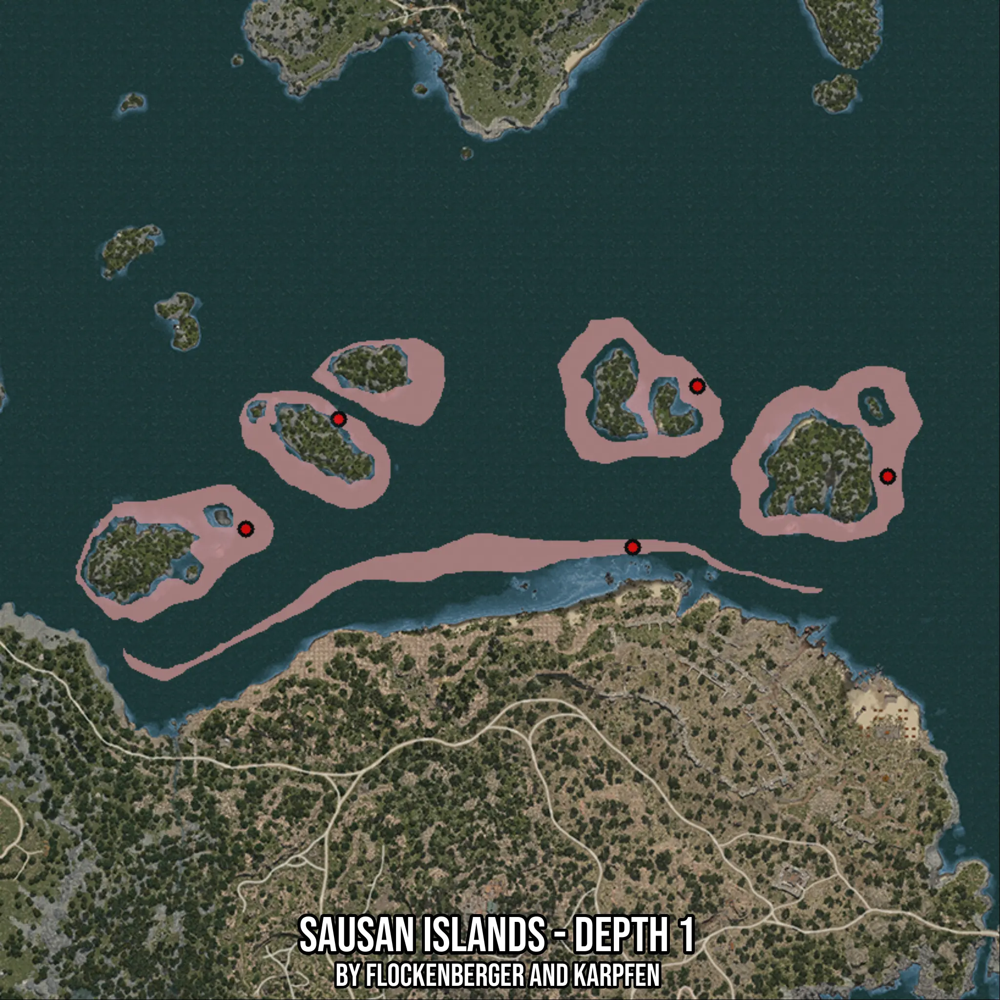

# Sausan Islands - Depth 1
Created by **flockenberger**

- **Red Points**: Exact in-game waypoints.
- **Colored Areas**: Entire area where the fishing table is consistent.
## ⚠️ Info about your float:
To verify your fishing position without modifying your files, you can do so [here](https://flockenberger.github.io/bdo-fish-position/).
- Or watch the guide [here](https://youtu.be/t-VXcRoNojk)

## Waypoints
Below you'll find the Copy-Paste ready XML file for this Fishing-Zone.

```xml
	<!--
		Waypoints for: Sausan Islands - Depth 1
		Auto-Generated by: flockenberger
		Preview at: https://github.com/Flockenberger/bdo-fish-waypoints/tree/main/Bookmark/Sausan%20Islands%20-%20Depth%201
	-->
	<WorldmapBookMark>
		<BookMark BookMarkName="1: Sausan Islands - Depth 1" PosX="269854.162979126" PosY="-8175.0" PosZ="184018.78707408905" />
		<BookMark BookMarkName="2: Sausan Islands - Depth 1" PosX="206908.27939510345" PosY="-8175.0" PosZ="166550.5514383316" />
		<BookMark BookMarkName="3: Sausan Islands - Depth 1" PosX="222870.63264846802" PosY="-8175.0" PosZ="206305.84633350372" />
		<BookMark BookMarkName="4: Sausan Islands - Depth 1" PosX="111435.33635139465" PosY="-8175.0" PosZ="171068.19858551025" />
		<BookMark BookMarkName="5: Sausan Islands - Depth 1" PosX="134324.74856376648" PosY="-8175.0" PosZ="198174.08146858215" />
	</WorldmapBookMark>
```

## Usage Guide
[](https://youtu.be/W-bWmKdv8K8)

## Previews
     

 