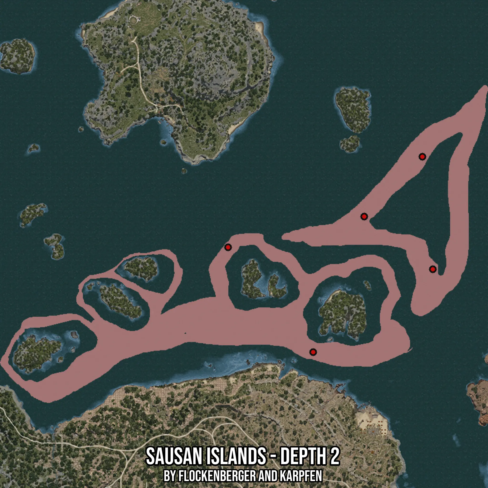

# Sausan Islands - Depth 2
Created by **flockenberger**

- **Red Points**: Exact in-game waypoints.
- **Colored Areas**: Entire area where the fishing table is consistent.
## ⚠️ Info about your float:
To verify your fishing position without modifying your files, you can do so [here](https://flockenberger.github.io/bdo-fish-position/).
- Or watch the guide [here](https://youtu.be/t-VXcRoNojk)

## Waypoints
Below you'll find the Copy-Paste ready XML file for this Fishing-Zone.

```xml
	<!--
		Waypoints for: Sausan Islands - Depth 2
		Auto-Generated by: flockenberger
		Preview at: https://github.com/Flockenberger/bdo-fish-waypoints/tree/main/Bookmark/Sausan%20Islands%20-%20Depth%202
	-->
	<WorldmapBookMark>
		<BookMark BookMarkName="1: Sausan Islands - Depth 2" PosX="236724.75056648254" PosY="-8175.0" PosZ="164442.31610298157" />
		<BookMark BookMarkName="2: Sausan Islands - Depth 2" PosX="296658.8693857193" PosY="-8175.0" PosZ="271661.14172935486" />
		<BookMark BookMarkName="3: Sausan Islands - Depth 2" PosX="302381.22243881226" PosY="-8175.0" PosZ="209919.96405124664" />
		<BookMark BookMarkName="4: Sausan Islands - Depth 2" PosX="190042.39671230316" PosY="-8175.0" PosZ="221967.0231103897" />
		<BookMark BookMarkName="5: Sausan Islands - Depth 2" PosX="264734.1628789902" PosY="-8175.0" PosZ="238832.90579319" />
	</WorldmapBookMark>
```

## Usage Guide
[](https://youtu.be/W-bWmKdv8K8)

## Previews
     

 