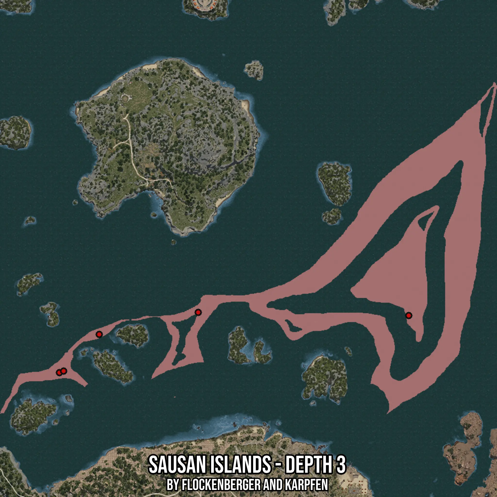

# Sausan Islands - Depth 3
Created by **flockenberger**

- **Red Points**: Exact in-game waypoints.
- **Colored Areas**: Entire area where the fishing table is consistent.
## ⚠️ Info about your float:
To verify your fishing position without modifying your files, you can do so [here](https://flockenberger.github.io/bdo-fish-position/).
- Or watch the guide [here](https://youtu.be/t-VXcRoNojk)

## Waypoints
Below you'll find the Copy-Paste ready XML file for this Fishing-Zone.

```xml
	<!--
		Waypoints for: Sausan Islands - Depth 3
		Auto-Generated by: flockenberger
		Preview at: https://github.com/Flockenberger/bdo-fish-waypoints/tree/main/Bookmark/Sausan%20Islands%20-%20Depth%203
	-->
	<WorldmapBookMark>
		<BookMark BookMarkName="1: Sausan Islands - Depth 3" PosX="180103.57298851013" PosY="-8175.0" PosZ="223472.9054927826" />
		<BookMark BookMarkName="2: Sausan Islands - Depth 3" PosX="301176.51653289795" PosY="-8175.0" PosZ="221665.84663391113" />
		<BookMark BookMarkName="3: Sausan Islands - Depth 3" PosX="100291.80672168732" PosY="-8175.0" PosZ="188837.61069774628" />
		<BookMark BookMarkName="4: Sausan Islands - Depth 3" PosX="123181.21893405914" PosY="-8175.0" PosZ="210823.49348068237" />
		<BookMark BookMarkName="5: Sausan Islands - Depth 3" PosX="102701.21853351593" PosY="-8175.0" PosZ="189741.140127182" />
	</WorldmapBookMark>
```

## Usage Guide
[](https://youtu.be/W-bWmKdv8K8)

## Previews
     

 