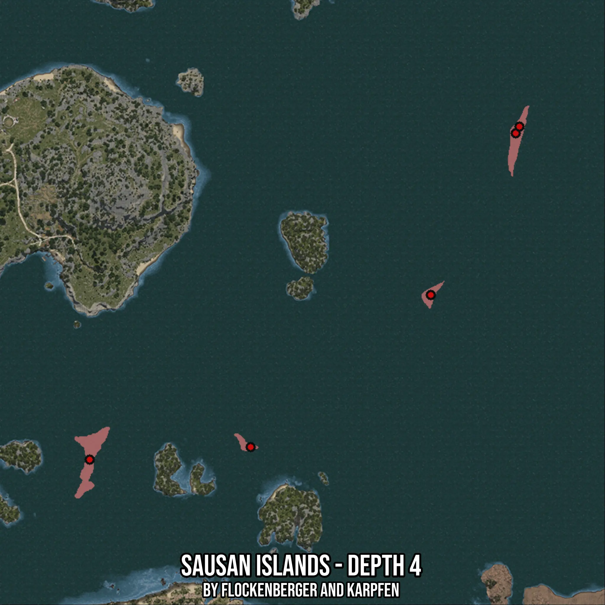

# Sausan Islands - Depth 4
Created by **flockenberger**

- **Red Points**: Exact in-game waypoints.
- **Colored Areas**: Entire area where the fishing table is consistent.
## ⚠️ Info about your float:
To verify your fishing position without modifying your files, you can do so [here](https://flockenberger.github.io/bdo-fish-position/).
- Or watch the guide [here](https://youtu.be/t-VXcRoNojk)

## Waypoints
Below you'll find the Copy-Paste ready XML file for this Fishing-Zone.

```xml
	<!--
		Waypoints for: Sausan Islands - Depth 4
		Auto-Generated by: flockenberger
		Preview at: https://github.com/Flockenberger/bdo-fish-waypoints/tree/main/Bookmark/Sausan%20Islands%20-%20Depth%204
	-->
	<WorldmapBookMark>
		<BookMark BookMarkName="1: Sausan Islands - Depth 4" PosX="171068.27869415283" PosY="-8175.0" PosZ="208715.25814533234" />
		<BookMark BookMarkName="2: Sausan Islands - Depth 4" PosX="344847.10562229156" PosY="-8175.0" PosZ="341835.2607488632" />
		<BookMark BookMarkName="3: Sausan Islands - Depth 4" PosX="310211.81082725525" PosY="-8175.0" PosZ="275877.61240005493" />
		<BookMark BookMarkName="4: Sausan Islands - Depth 4" PosX="236724.75056648254" PosY="-8175.0" PosZ="213835.25824546814" />
		<BookMark BookMarkName="5: Sausan Islands - Depth 4" PosX="346352.98800468445" PosY="-8175.0" PosZ="344545.8490371704" />
	</WorldmapBookMark>
```

## Usage Guide
[](https://youtu.be/W-bWmKdv8K8)

## Previews
     

 