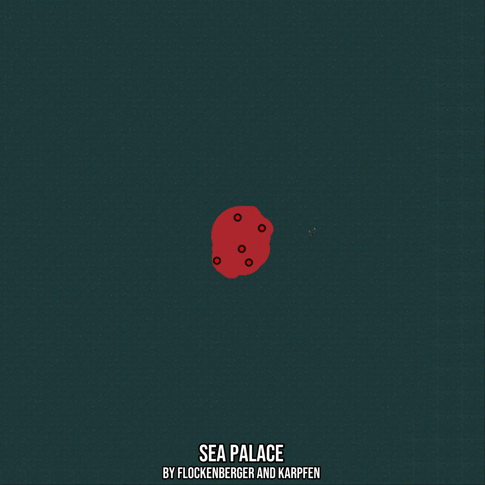

# Sea Palace
Created by **flockenberger**

- **Red Points**: Exact in-game waypoints.
- **Colored Areas**: Entire area where the fishing table is consistent.
## ⚠️ Info about your float:
To verify your fishing position without modifying your files, you can do so [here](https://flockenberger.github.io/bdo-fish-position/).
- Or watch the guide [here](https://youtu.be/t-VXcRoNojk)

## Waypoints
Below you'll find the Copy-Paste ready XML file for this Fishing-Zone.

```xml
	<!--
		Waypoints for: Sea Palace
		Auto-Generated by: flockenberger
		Preview at: https://github.com/Flockenberger/bdo-fish-waypoints/tree/main/Bookmark/Sea%20Palace
	-->
	<WorldmapBookMark>
		<BookMark BookMarkName="1: Sea Palace" PosX="-890578.8008928299" PosY="-8175.0" PosZ="1083030.5693626404" />
		<BookMark BookMarkName="2: Sea Palace" PosX="-897204.6833753586" PosY="-8175.0" PosZ="1065562.333726883" />
		<BookMark BookMarkName="3: Sea Palace" PosX="-902927.0364284515" PosY="-8175.0" PosZ="1088451.7459392548" />
		<BookMark BookMarkName="4: Sea Palace" PosX="-913468.2131052017" PosY="-8175.0" PosZ="1066465.8631563187" />
		<BookMark BookMarkName="5: Sea Palace" PosX="-900818.8010931015" PosY="-8175.0" PosZ="1072489.3926858902" />
	</WorldmapBookMark>
```

## Usage Guide
[](https://youtu.be/W-bWmKdv8K8)

## Previews
     

 