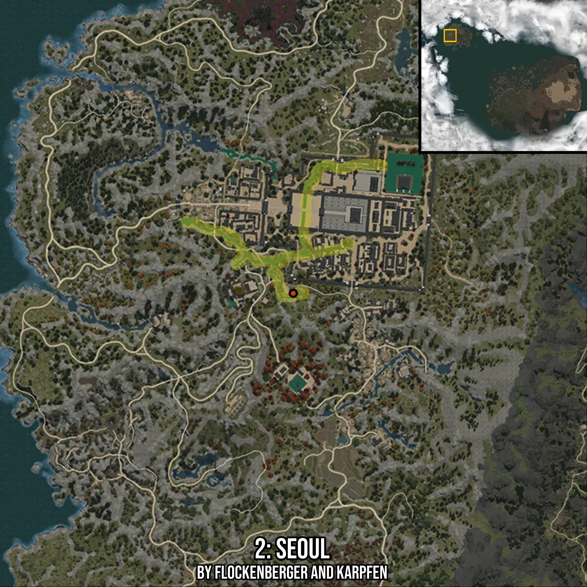

# Seoul
Created by **flockenberger**

- **Red Points**: Exact in-game waypoints.
- **Colored Areas**: Entire area where the fishing table is consistent.
## ⚠️ Info about your float:
To verify your fishing position without modifying your files, you can do so [here](https://flockenberger.github.io/bdo-fish-position/).
- Or watch the guide [here](https://youtu.be/t-VXcRoNojk)

## Waypoints
Below you'll find the Copy-Paste ready XML file for this Fishing-Zone.

```xml
	<!--
		Waypoints for: Seoul
		Auto-Generated by: flockenberger
		Preview at: https://github.com/Flockenberger/bdo-fish-waypoints/tree/main/Bookmark/Seoul
	-->
	<WorldmapBookMark>
		<BookMark BookMarkName="1: Seoul" PosX="-1439322.3410367966" PosY="0.0" PosZ="1324875.2799749374" />
		<BookMark BookMarkName="2: Seoul" PosX="-1443839.9881839752" PosY="0.0" PosZ="1300479.9853801727" />
		<BookMark BookMarkName="3: Seoul" PosX="-1464922.3415374756" PosY="0.0" PosZ="1315237.632727623" />
		<BookMark BookMarkName="4: Seoul" PosX="-1439623.5175132751" PosY="0.0" PosZ="1327284.691786766" />
		<BookMark BookMarkName="5: Seoul" PosX="-1448056.4588546753" PosY="0.0" PosZ="1315538.8092041016" />
	</WorldmapBookMark>
```

## Usage Guide
[](https://youtu.be/W-bWmKdv8K8)

## Previews
     

 