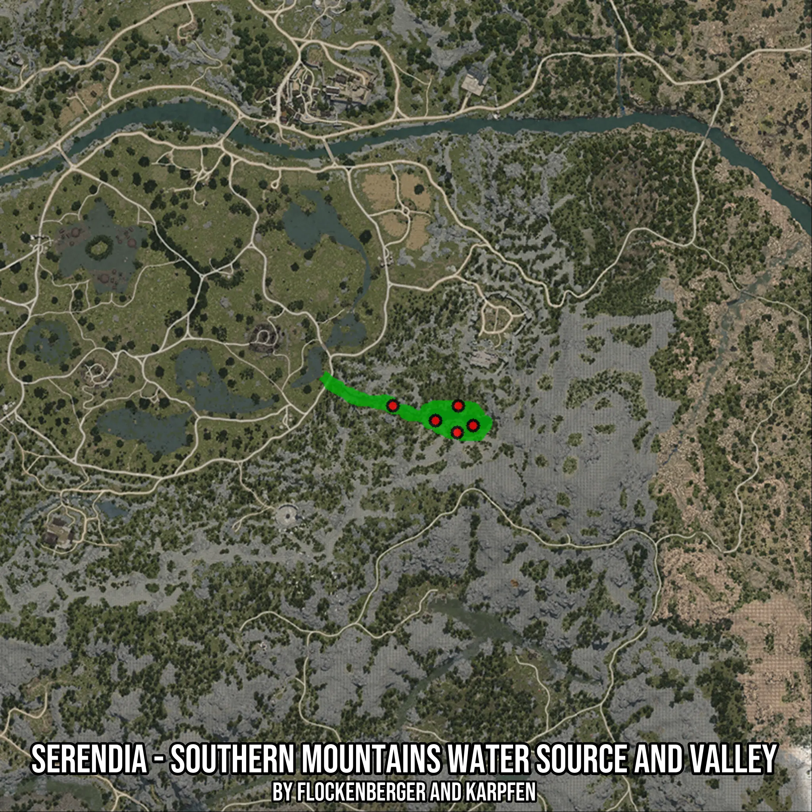

# Serendia - Southern Mountains Water Source and Valley
Created by **flockenberger**

- **Red Points**: Exact in-game waypoints.
- **Colored Areas**: Entire area where the fishing table is consistent.
## ⚠️ Info about your float:
To verify your fishing position without modifying your files, you can do so [here](https://flockenberger.github.io/bdo-fish-position/).
- Or watch the guide [here](https://youtu.be/t-VXcRoNojk)

## Waypoints
Below you'll find the Copy-Paste ready XML file for this Fishing-Zone.

```xml
	<!--
		Waypoints for: Serendia - Southern Mountains Water Source and Valley
		Auto-Generated by: flockenberger
		Preview at: https://github.com/Flockenberger/bdo-fish-waypoints/tree/main/Bookmark/Serendia%20-%20Southern%20Mountains%20Water%20Source%20and%20Valley
	-->
	<WorldmapBookMark>
		<BookMark BookMarkName="1: Serendia - Southern Mountains Water Source and Valley" PosX="71981.21793270111" PosY="0.0" PosZ="-130710.63084602356" />
		<BookMark BookMarkName="2: Serendia - Southern Mountains Water Source and Valley" PosX="91557.6889038086" PosY="0.0" PosZ="-138842.39571094513" />
		<BookMark BookMarkName="3: Serendia - Southern Mountains Water Source and Valley" PosX="91858.86538028717" PosY="0.0" PosZ="-130710.63084602356" />
		<BookMark BookMarkName="4: Serendia - Southern Mountains Water Source and Valley" PosX="96376.51252746582" PosY="0.0" PosZ="-136734.1603755951" />
		<BookMark BookMarkName="5: Serendia - Southern Mountains Water Source and Valley" PosX="84931.8064212799" PosY="0.0" PosZ="-135228.2779932022" />
	</WorldmapBookMark>
```

## Usage Guide
[](https://youtu.be/W-bWmKdv8K8)

## Previews
     

 