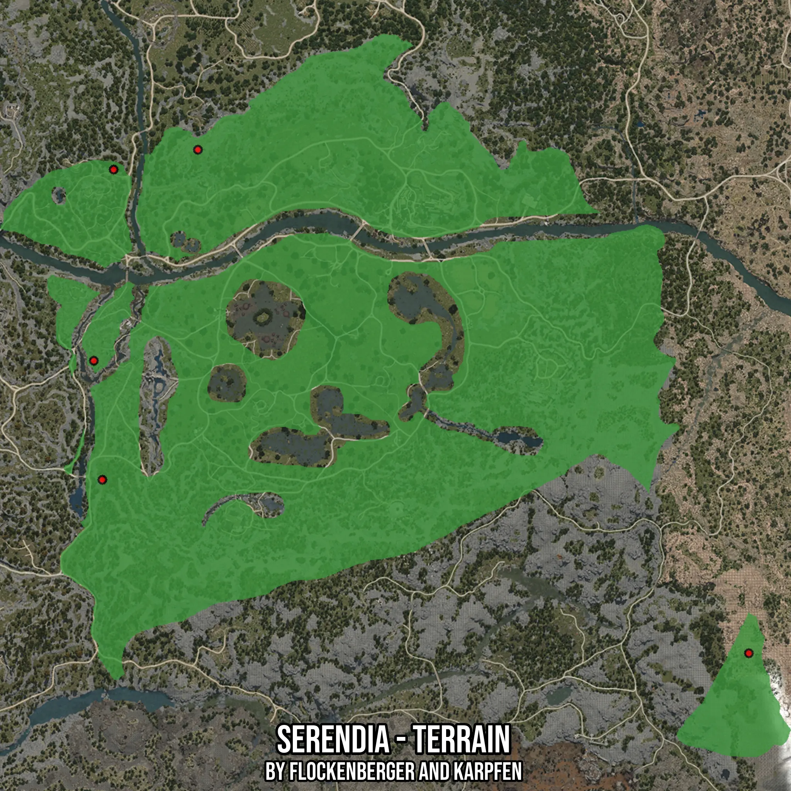

# Serendia - Terrain
Created by **flockenberger**

- **Red Points**: Exact in-game waypoints.
- **Colored Areas**: Entire area where the fishing table is consistent.
## ⚠️ Info about your float:
To verify your fishing position without modifying your files, you can do so [here](https://flockenberger.github.io/bdo-fish-position/).
- Or watch the guide [here](https://youtu.be/t-VXcRoNojk)

## Waypoints
Below you'll find the Copy-Paste ready XML file for this Fishing-Zone.

```xml
	<!--
		Waypoints for: Serendia - Terrain
		Auto-Generated by: flockenberger
		Preview at: https://github.com/Flockenberger/bdo-fish-waypoints/tree/main/Bookmark/Serendia%20-%20Terrain
	-->
	<WorldmapBookMark>
		<BookMark BookMarkName="1: Serendia - Terrain" PosX="-85534.07926559448" PosY="0.0" PosZ="-151792.98419952393" />
		<BookMark BookMarkName="2: Serendia - Terrain" PosX="-44875.25494098663" PosY="0.0" PosZ="-11444.746160507202" />
		<BookMark BookMarkName="3: Serendia - Terrain" PosX="-80715.25564193726" PosY="0.0" PosZ="-19877.68750190735" />
		<BookMark BookMarkName="4: Serendia - Terrain" PosX="189440.043759346" PosY="0.0" PosZ="-225581.2209367752" />
		<BookMark BookMarkName="5: Serendia - Terrain" PosX="-89148.1969833374" PosY="0.0" PosZ="-101195.33615112305" />
	</WorldmapBookMark>
```

## Usage Guide
[](https://youtu.be/W-bWmKdv8K8)

## Previews
     

 