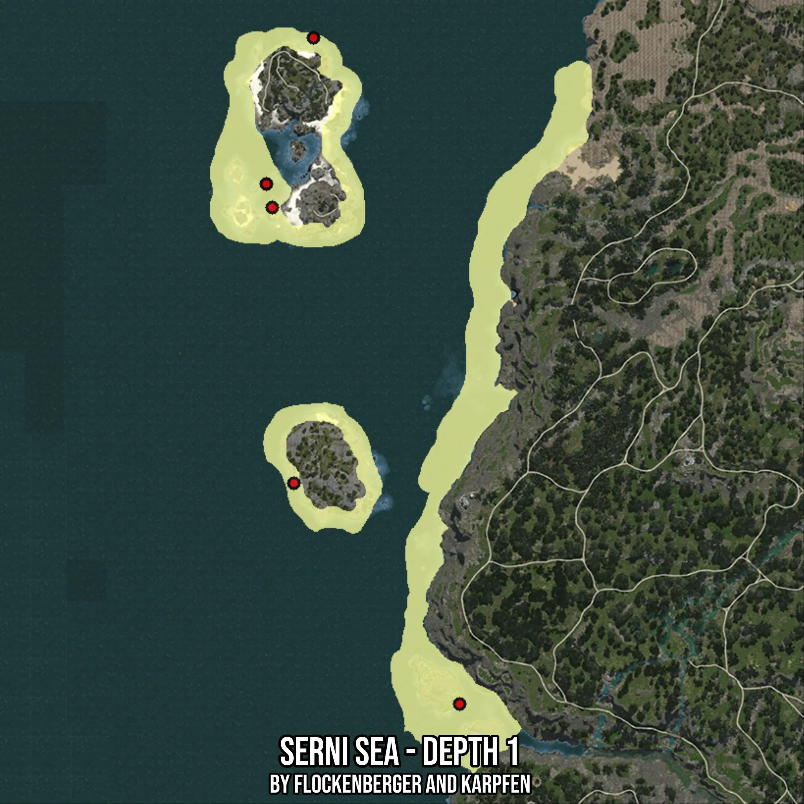

# Serni Sea - Depth 1
Created by **flockenberger**

- **Red Points**: Exact in-game waypoints.
- **Colored Areas**: Entire area where the fishing table is consistent.
## ⚠️ Info about your float:
To verify your fishing position without modifying your files, you can do so [here](https://flockenberger.github.io/bdo-fish-position/).
- Or watch the guide [here](https://youtu.be/t-VXcRoNojk)

## Waypoints
Below you'll find the Copy-Paste ready XML file for this Fishing-Zone.

```xml
	<!--
		Waypoints for: Serni Sea - Depth 1
		Auto-Generated by: flockenberger
		Preview at: https://github.com/Flockenberger/bdo-fish-waypoints/tree/main/Bookmark/Serni%20Sea%20-%20Depth%201
	-->
	<WorldmapBookMark>
		<BookMark BookMarkName="1: Serni Sea - Depth 1" PosX="-607472.9130029678" PosY="-8175.0" PosZ="-351472.98810482025" />
		<BookMark BookMarkName="2: Serni Sea - Depth 1" PosX="-666804.6788692474" PosY="-8175.0" PosZ="-191849.45557117462" />
		<BookMark BookMarkName="3: Serni Sea - Depth 1" PosX="-658371.7375278473" PosY="-8175.0" PosZ="-283708.2808971405" />
		<BookMark BookMarkName="4: Serni Sea - Depth 1" PosX="-664997.620010376" PosY="-8175.0" PosZ="-199077.69100666046" />
		<BookMark BookMarkName="5: Serni Sea - Depth 1" PosX="-652348.2079982758" PosY="-8175.0" PosZ="-146974.1605758667" />
	</WorldmapBookMark>
```

## Usage Guide
[](https://youtu.be/W-bWmKdv8K8)

## Previews
     

 