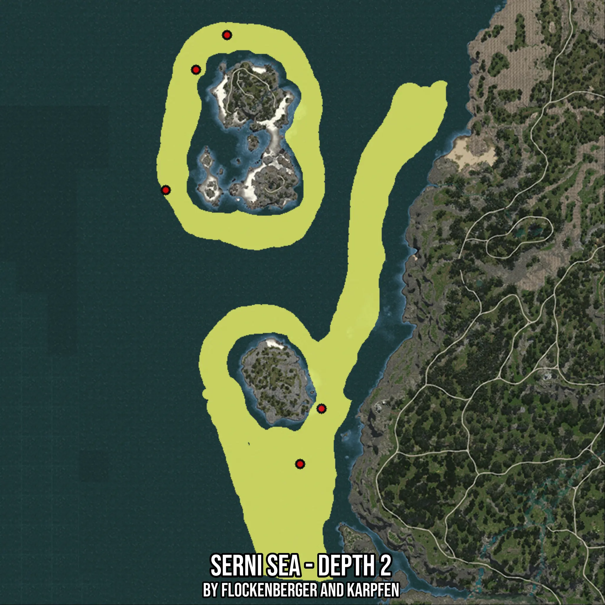

# Serni Sea - Depth 2
Created by **flockenberger**

- **Red Points**: Exact in-game waypoints.
- **Colored Areas**: Entire area where the fishing table is consistent.
## ⚠️ Info about your float:
To verify your fishing position without modifying your files, you can do so [here](https://flockenberger.github.io/bdo-fish-position/).
- Or watch the guide [here](https://youtu.be/t-VXcRoNojk)

## Waypoints
Below you'll find the Copy-Paste ready XML file for this Fishing-Zone.

```xml
	<!--
		Waypoints for: Serni Sea - Depth 2
		Auto-Generated by: flockenberger
		Preview at: https://github.com/Flockenberger/bdo-fish-waypoints/tree/main/Bookmark/Serni%20Sea%20-%20Depth%202
	-->
	<WorldmapBookMark>
		<BookMark BookMarkName="1: Serni Sea - Depth 2" PosX="-629157.6193094254" PosY="-8175.0" PosZ="-290032.9869031906" />
		<BookMark BookMarkName="2: Serni Sea - Depth 2" PosX="-667708.2082986832" PosY="-8175.0" PosZ="-137637.68980503082" />
		<BookMark BookMarkName="3: Serni Sea - Depth 2" PosX="-692705.855846405" PosY="-8175.0" PosZ="-200884.74986553192" />
		<BookMark BookMarkName="4: Serni Sea - Depth 2" PosX="-680357.6203107834" PosY="-8175.0" PosZ="-151792.98419952393" />
		<BookMark BookMarkName="5: Serni Sea - Depth 2" PosX="-637891.7371273041" PosY="-8175.0" PosZ="-312621.22263908386" />
	</WorldmapBookMark>
```

## Usage Guide
[](https://youtu.be/W-bWmKdv8K8)

## Previews
     

 