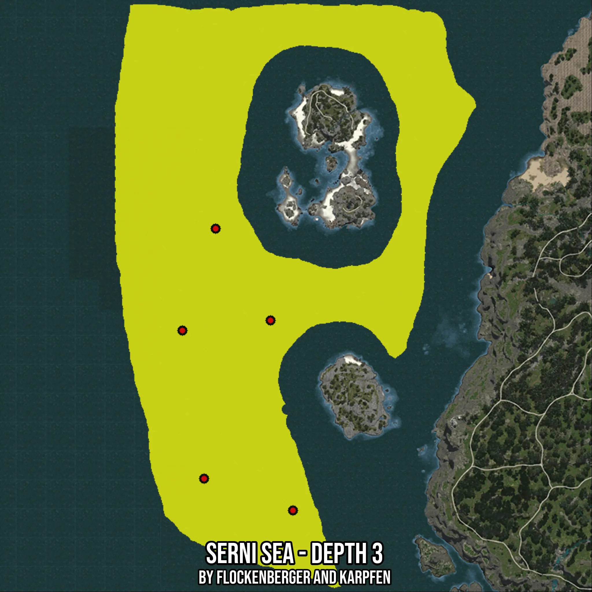

# Serni Sea - Depth 3
Created by **flockenberger**

- **Red Points**: Exact in-game waypoints.
- **Colored Areas**: Entire area where the fishing table is consistent.
## ⚠️ Info about your float:
To verify your fishing position without modifying your files, you can do so [here](https://flockenberger.github.io/bdo-fish-position/).
- Or watch the guide [here](https://youtu.be/t-VXcRoNojk)

## Waypoints
Below you'll find the Copy-Paste ready XML file for this Fishing-Zone.

```xml
	<!--
		Waypoints for: Serni Sea - Depth 3
		Auto-Generated by: flockenberger
		Preview at: https://github.com/Flockenberger/bdo-fish-waypoints/tree/main/Bookmark/Serni%20Sea%20-%20Depth%203
	-->
	<WorldmapBookMark>
		<BookMark BookMarkName="1: Serni Sea - Depth 3" PosX="-710174.0914821625" PosY="-8175.0" PosZ="-312922.39911556244" />
		<BookMark BookMarkName="2: Serni Sea - Depth 3" PosX="-705355.2678585052" PosY="-8175.0" PosZ="-208715.3382539749" />
		<BookMark BookMarkName="3: Serni Sea - Depth 3" PosX="-719209.3857765198" PosY="-8175.0" PosZ="-251181.22143745422" />
		<BookMark BookMarkName="4: Serni Sea - Depth 3" PosX="-682465.8556461334" PosY="-8175.0" PosZ="-246964.75076675415" />
		<BookMark BookMarkName="5: Serni Sea - Depth 3" PosX="-673129.3848752975" PosY="-8175.0" PosZ="-326174.1640806198" />
	</WorldmapBookMark>
```

## Usage Guide
[](https://youtu.be/W-bWmKdv8K8)

## Previews
     

 