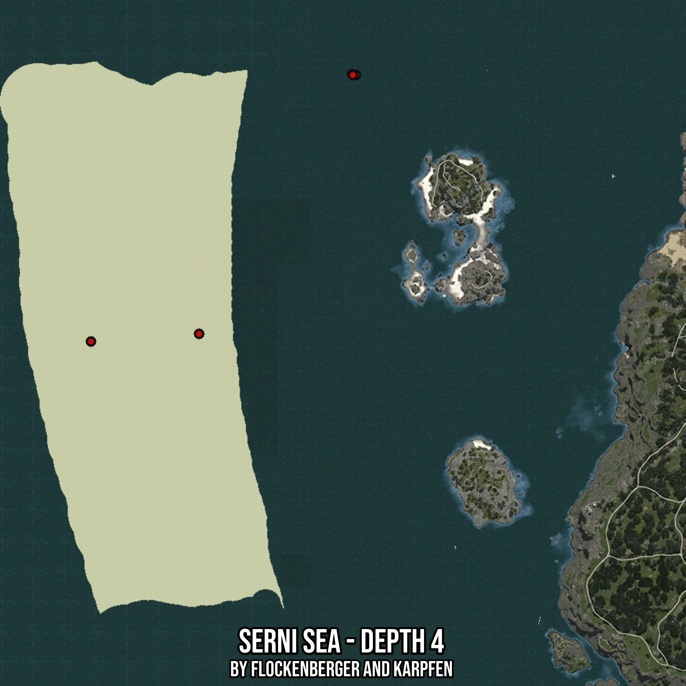

# Serni Sea - Depth 4
Created by **flockenberger**

- **Red Points**: Exact in-game waypoints.
- **Colored Areas**: Entire area where the fishing table is consistent.
## ⚠️ Info about your float:
To verify your fishing position without modifying your files, you can do so [here](https://flockenberger.github.io/bdo-fish-position/).
- Or watch the guide [here](https://youtu.be/t-VXcRoNojk)

## Waypoints
Below you'll find the Copy-Paste ready XML file for this Fishing-Zone.

```xml
	<!--
		Waypoints for: Serni Sea - Depth 4
		Auto-Generated by: flockenberger
		Preview at: https://github.com/Flockenberger/bdo-fish-waypoints/tree/main/Bookmark/Serni%20Sea%20-%20Depth%204
	-->
	<WorldmapBookMark>
		<BookMark BookMarkName="1: Serni Sea - Depth 4" PosX="-802936.4462375641" PosY="-8175.0" PosZ="-222870.63264846802" />
		<BookMark BookMarkName="2: Serni Sea - Depth 4" PosX="-698127.0324230194" PosY="-8175.0" PosZ="-117458.86588096619" />
		<BookMark BookMarkName="3: Serni Sea - Depth 4" PosX="-699632.9148054123" PosY="-8175.0" PosZ="-117157.68940448761" />
		<BookMark BookMarkName="4: Serni Sea - Depth 4" PosX="-760169.3865776062" PosY="-8175.0" PosZ="-219858.86788368225" />
		<BookMark BookMarkName="5: Serni Sea - Depth 4" PosX="-699331.7383289337" PosY="-8175.0" PosZ="-117458.86588096619" />
	</WorldmapBookMark>
```

## Usage Guide
[](https://youtu.be/W-bWmKdv8K8)

## Previews
     

 