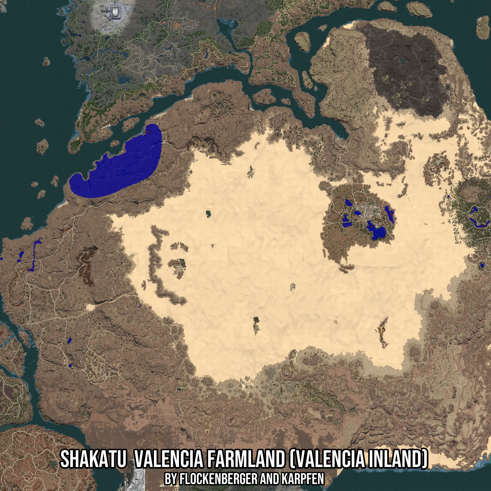

# Shakatu  Valencia Farmland (Valencia Inland)
Created by **flockenberger**

- **Red Points**: Exact in-game waypoints.
- **Colored Areas**: Entire area where the fishing table is consistent.
## ⚠️ Info about your float:
To verify your fishing position without modifying your files, you can do so [here](https://flockenberger.github.io/bdo-fish-position/).
- Or watch the guide [here](https://youtu.be/t-VXcRoNojk)

## Waypoints
Below you'll find the Copy-Paste ready XML file for this Fishing-Zone.

```xml
	<!--
		Waypoints for: Shakatu  Valencia Farmland (Valencia Inland)
		Auto-Generated by: flockenberger
		Preview at: https://github.com/Flockenberger/bdo-fish-waypoints/tree/main/Bookmark/Shakatu%20%20Valencia%20Farmland%20(Valencia%20Inland)
	-->
	<WorldmapBookMark>
		<BookMark BookMarkName="1: Shakatu  Valencia Farmland (Valencia Inland)" PosX="620423.5816001892" PosY="0.0" PosZ="354183.49628448486" />
		<BookMark BookMarkName="2: Shakatu  Valencia Farmland (Valencia Inland)" PosX="1036950.6485700607" PosY="0.0" PosZ="177694.08106803894" />
		<BookMark BookMarkName="3: Shakatu  Valencia Farmland (Valencia Inland)" PosX="1073995.3551769257" PosY="0.0" PosZ="201185.84623336792" />
		<BookMark BookMarkName="4: Shakatu  Valencia Farmland (Valencia Inland)" PosX="1245967.123246193" PosY="0.0" PosZ="178597.61049747467" />
		<BookMark BookMarkName="5: Shakatu  Valencia Farmland (Valencia Inland)" PosX="397251.8125295639" PosY="0.0" PosZ="96677.60889530182" />
	</WorldmapBookMark>
```

## Usage Guide
[](https://youtu.be/W-bWmKdv8K8)

## Previews
     

 