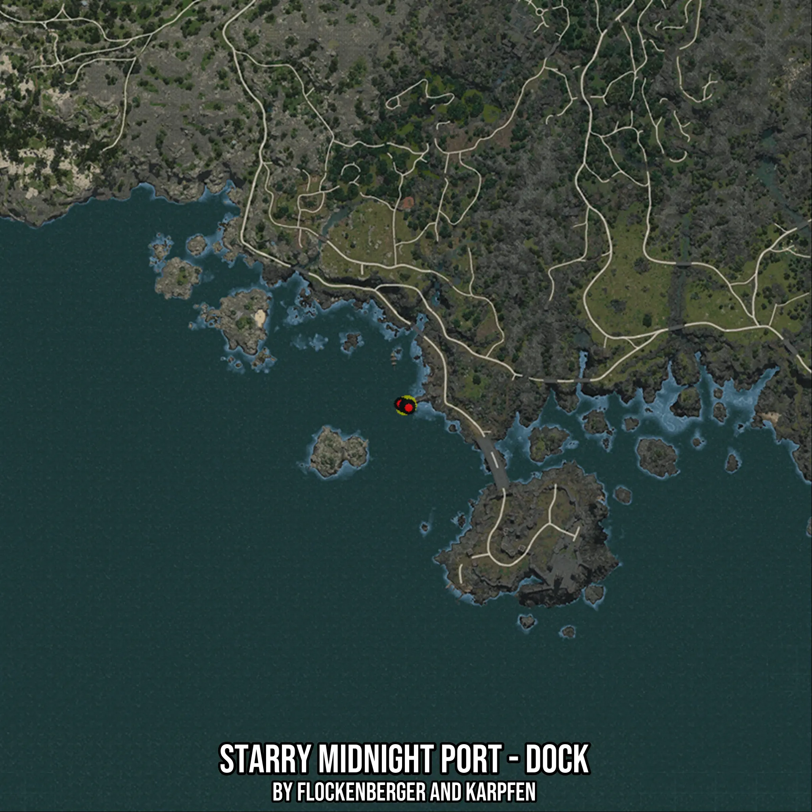

# Starry Midnight Port - Dock
Created by **flockenberger**

- **Red Points**: Exact in-game waypoints.
- **Colored Areas**: Entire area where the fishing table is consistent.
## ⚠️ Info about your float:
To verify your fishing position without modifying your files, you can do so [here](https://flockenberger.github.io/bdo-fish-position/).
- Or watch the guide [here](https://youtu.be/t-VXcRoNojk)

## Waypoints
Below you'll find the Copy-Paste ready XML file for this Fishing-Zone.

```xml
	<!--
		Waypoints for: Starry Midnight Port - Dock
		Auto-Generated by: flockenberger
		Preview at: https://github.com/Flockenberger/bdo-fish-waypoints/tree/main/Bookmark/Starry%20Midnight%20Port%20-%20Dock
	-->
	<WorldmapBookMark>
		<BookMark BookMarkName="1: Starry Midnight Port - Dock" PosX="-327679.9663543701" PosY="-8175.0" PosZ="-617411.8168354034" />
		<BookMark BookMarkName="2: Starry Midnight Port - Dock" PosX="-328583.49578380585" PosY="-8175.0" PosZ="-616809.4638824463" />
		<BookMark BookMarkName="3: Starry Midnight Port - Dock" PosX="-327077.61340141296" PosY="-8175.0" PosZ="-617411.8168354034" />
		<BookMark BookMarkName="4: Starry Midnight Port - Dock" PosX="-326174.08397197723" PosY="-8175.0" PosZ="-617411.8168354034" />
		<BookMark BookMarkName="5: Starry Midnight Port - Dock" PosX="-326174.08397197723" PosY="-8175.0" PosZ="-618014.1697883606" />
	</WorldmapBookMark>
```

## Usage Guide
[](https://youtu.be/W-bWmKdv8K8)

## Previews
     

 