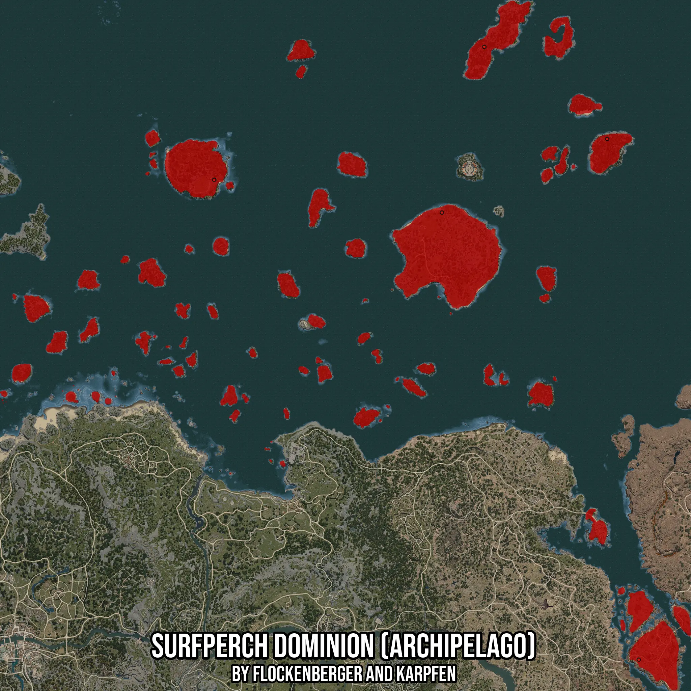

# Surfperch Dominion (Archipelago)
Created by **flockenberger**

- **Red Points**: Exact in-game waypoints.
- **Colored Areas**: Entire area where the fishing table is consistent.
## ⚠️ Info about your float:
To verify your fishing position without modifying your files, you can do so [here](https://flockenberger.github.io/bdo-fish-position/).
- Or watch the guide [here](https://youtu.be/t-VXcRoNojk)

## Waypoints
Below you'll find the Copy-Paste ready XML file for this Fishing-Zone.

```xml
	<!--
		Waypoints for: Surfperch Dominion (Archipelago)
		Auto-Generated by: flockenberger
		Preview at: https://github.com/Flockenberger/bdo-fish-waypoints/tree/main/Bookmark/Surfperch%20Dominion%20(Archipelago)
	-->
	<WorldmapBookMark>
		<BookMark BookMarkName="1: Surfperch Dominion (Archipelago)" PosX="157214.1607761383" PosY="-8175.0" PosZ="361411.7317199707" />
		<BookMark BookMarkName="2: Surfperch Dominion (Archipelago)" PosX="-62644.667053222656" PosY="-8175.0" PosZ="393035.26175022125" />
		<BookMark BookMarkName="3: Surfperch Dominion (Archipelago)" PosX="347256.5174341202" PosY="-8175.0" PosZ="-70174.15907382965" />
		<BookMark BookMarkName="4: Surfperch Dominion (Archipelago)" PosX="198174.16157722473" PosY="-8175.0" PosZ="521336.4407300949" />
		<BookMark BookMarkName="5: Surfperch Dominion (Archipelago)" PosX="316837.69330978394" PosY="-8175.0" PosZ="432489.3801689148" />
	</WorldmapBookMark>
```

## Usage Guide
[](https://youtu.be/W-bWmKdv8K8)

## Previews
     

 