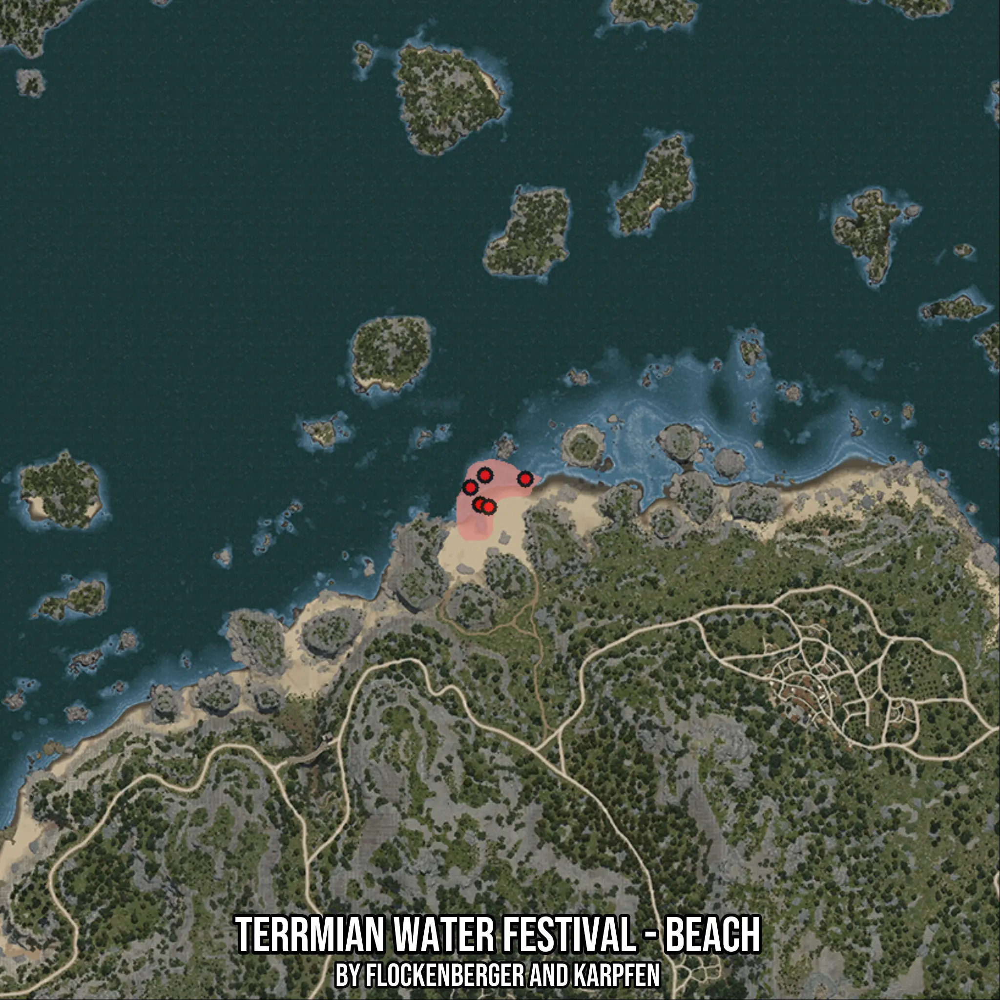

# Terrmian Water Festival - Beach
Created by **flockenberger**

- **Red Points**: Exact in-game waypoints.
- **Colored Areas**: Entire area where the fishing table is consistent.
## ⚠️ Info about your float:
To verify your fishing position without modifying your files, you can do so [here](https://flockenberger.github.io/bdo-fish-position/).
- Or watch the guide [here](https://youtu.be/t-VXcRoNojk)

## Waypoints
Below you'll find the Copy-Paste ready XML file for this Fishing-Zone.

```xml
	<!--
		Waypoints for: Terrmian Water Festival - Beach
		Auto-Generated by: flockenberger
		Preview at: https://github.com/Flockenberger/bdo-fish-waypoints/tree/main/Bookmark/Terrmian%20Water%20Festival%20-%20Beach
	-->
	<WorldmapBookMark>
		<BookMark BookMarkName="1: Terrmian Water Festival - Beach" PosX="-228291.72911643982" PosY="-8175.0" PosZ="173176.4339208603" />
		<BookMark BookMarkName="2: Terrmian Water Festival - Beach" PosX="-224677.6113986969" PosY="-8175.0" PosZ="176188.19868564606" />
		<BookMark BookMarkName="3: Terrmian Water Festival - Beach" PosX="-225882.3173046112" PosY="-8175.0" PosZ="168959.96325016022" />
		<BookMark BookMarkName="4: Terrmian Water Festival - Beach" PosX="-223774.08196926117" PosY="-8175.0" PosZ="168357.61029720306" />
		<BookMark BookMarkName="5: Terrmian Water Festival - Beach" PosX="-214738.78767490387" PosY="-8175.0" PosZ="175284.66925621033" />
	</WorldmapBookMark>
```

## Usage Guide
[](https://youtu.be/W-bWmKdv8K8)

## Previews
     

 