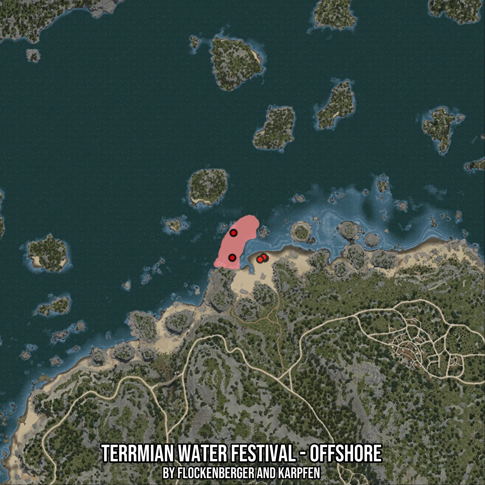

# Terrmian Water Festival - Offshore
Created by **flockenberger**

- **Red Points**: Exact in-game waypoints.
- **Colored Areas**: Entire area where the fishing table is consistent.
## ⚠️ Info about your float:
To verify your fishing position without modifying your files, you can do so [here](https://flockenberger.github.io/bdo-fish-position/).
- Or watch the guide [here](https://youtu.be/t-VXcRoNojk)

## Waypoints
Below you'll find the Copy-Paste ready XML file for this Fishing-Zone.

```xml
	<!--
		Waypoints for: Terrmian Water Festival - Offshore
		Auto-Generated by: flockenberger
		Preview at: https://github.com/Flockenberger/bdo-fish-waypoints/tree/main/Bookmark/Terrmian%20Water%20Festival%20-%20Offshore
	-->
	<WorldmapBookMark>
		<BookMark BookMarkName="1: Terrmian Water Festival - Offshore" PosX="-234917.6115989685" PosY="-8175.0" PosZ="182814.08116817474" />
		<BookMark BookMarkName="2: Terrmian Water Festival - Offshore" PosX="-218955.25834560394" PosY="-8175.0" PosZ="169863.49267959595" />
		<BookMark BookMarkName="3: Terrmian Water Festival - Offshore" PosX="-219557.6112985611" PosY="-8175.0" PosZ="170465.8456325531" />
		<BookMark BookMarkName="4: Terrmian Water Festival - Offshore" PosX="-235519.96455192566" PosY="-8175.0" PosZ="170164.66915607452" />
		<BookMark BookMarkName="5: Terrmian Water Festival - Offshore" PosX="-221364.67015743256" PosY="-8175.0" PosZ="169261.1397266388" />
	</WorldmapBookMark>
```

## Usage Guide
[](https://youtu.be/W-bWmKdv8K8)

## Previews
     

 