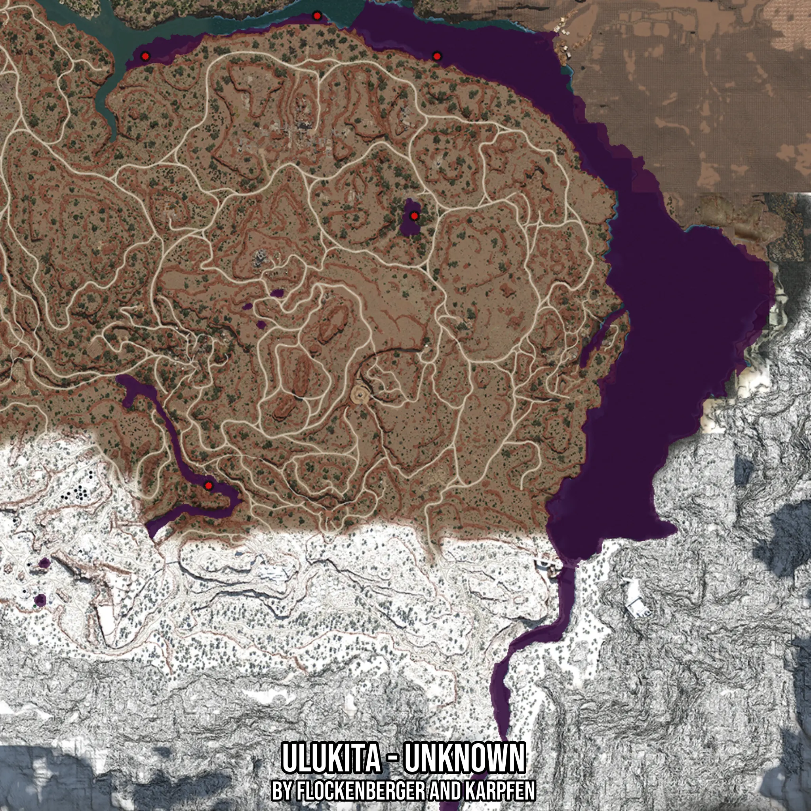

# Ulukita - Unknown
Created by **flockenberger**

- **Red Points**: Exact in-game waypoints.
- **Colored Areas**: Entire area where the fishing table is consistent.
## ⚠️ Info about your float:
To verify your fishing position without modifying your files, you can do so [here](https://flockenberger.github.io/bdo-fish-position/).
- Or watch the guide [here](https://youtu.be/t-VXcRoNojk)

## Waypoints
Below you'll find the Copy-Paste ready XML file for this Fishing-Zone.

```xml
	<!--
		Waypoints for: Ulukita - Unknown
		Auto-Generated by: flockenberger
		Preview at: https://github.com/Flockenberger/bdo-fish-waypoints/tree/main/Bookmark/Ulukita%20-%20Unknown
	-->
	<WorldmapBookMark>
		<BookMark BookMarkName="1: Ulukita - Unknown" PosX="452367.10772514343" PosY="0.0" PosZ="-205402.39701271057" />
		<BookMark BookMarkName="2: Ulukita - Unknown" PosX="367435.3413581848" PosY="0.0" PosZ="-365025.9295463562" />
		<BookMark BookMarkName="3: Ulukita - Unknown" PosX="343943.57619285583" PosY="0.0" PosZ="-205402.39701271057" />
		<BookMark BookMarkName="4: Ulukita - Unknown" PosX="407792.9892063141" PosY="-8175.0" PosZ="-190343.57318878174" />
		<BookMark BookMarkName="5: Ulukita - Unknown" PosX="443934.1663837433" PosY="0.0" PosZ="-264734.1628789902" />
	</WorldmapBookMark>
```

## Usage Guide
[](https://youtu.be/W-bWmKdv8K8)

## Previews
     

 