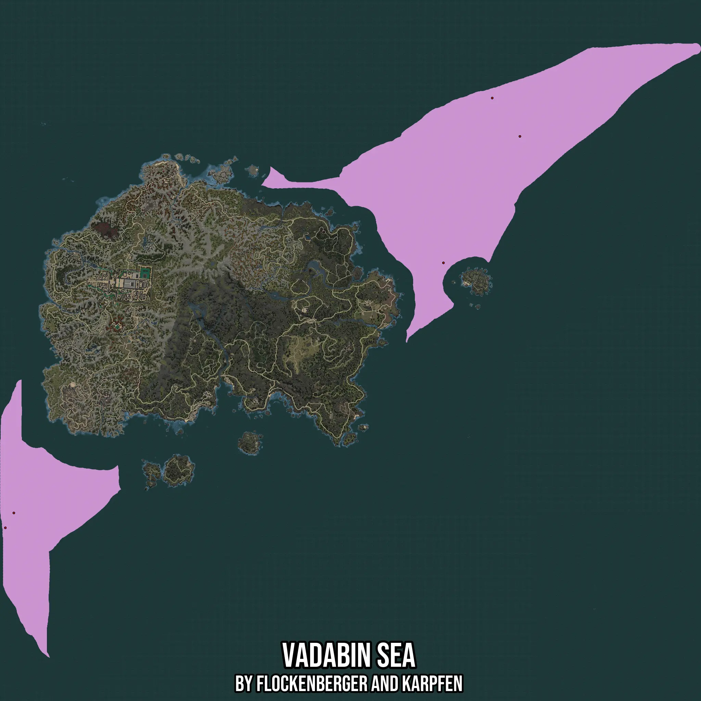

# Vadabin Sea
Created by **flockenberger**

- **Red Points**: Exact in-game waypoints.
- **Colored Areas**: Entire area where the fishing table is consistent.
## ⚠️ Info about your float:
To verify your fishing position without modifying your files, you can do so [here](https://flockenberger.github.io/bdo-fish-position/).
- Or watch the guide [here](https://youtu.be/t-VXcRoNojk)

## Waypoints
Below you'll find the Copy-Paste ready XML file for this Fishing-Zone.

```xml
	<!--
		Waypoints for: Vadabin Sea
		Auto-Generated by: flockenberger
		Preview at: https://github.com/Flockenberger/bdo-fish-waypoints/tree/main/Bookmark/Vadabin%20Sea
	-->
	<WorldmapBookMark>
		<BookMark BookMarkName="1: Vadabin Sea" PosX="-781251.7399311066" PosY="-8175.0" PosZ="1576056.4613580704" />
		<BookMark BookMarkName="2: Vadabin Sea" PosX="-1626352.9329299927" PosY="0.0" PosZ="933044.6840763092" />
		<BookMark BookMarkName="3: Vadabin Sea" PosX="-1612498.8150119781" PosY="0.0" PosZ="957439.9786710739" />
		<BookMark BookMarkName="4: Vadabin Sea" PosX="-826729.3878793716" PosY="-8175.0" PosZ="1639002.344942093" />
		<BookMark BookMarkName="5: Vadabin Sea" PosX="-906842.330622673" PosY="-8175.0" PosZ="1368244.6925878525" />
	</WorldmapBookMark>
```

## Usage Guide
[](https://youtu.be/W-bWmKdv8K8)

## Previews
     

 