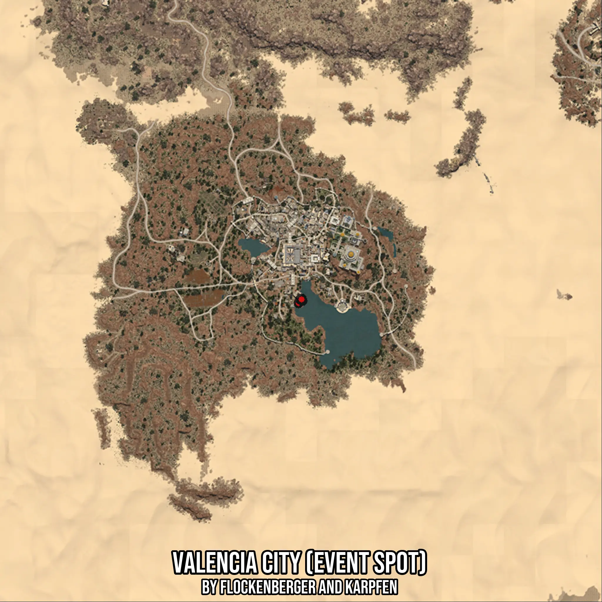

# Valencia City (Event Spot)
Created by **flockenberger**

- **Red Points**: Exact in-game waypoints.
- **Colored Areas**: Entire area where the fishing table is consistent.
## ⚠️ Info about your float:
To verify your fishing position without modifying your files, you can do so [here](https://flockenberger.github.io/bdo-fish-position/).
- Or watch the guide [here](https://youtu.be/t-VXcRoNojk)

## Waypoints
Below you'll find the Copy-Paste ready XML file for this Fishing-Zone.

```xml
	<!--
		Waypoints for: Valencia City (Event Spot)
		Auto-Generated by: flockenberger
		Preview at: https://github.com/Flockenberger/bdo-fish-waypoints/tree/main/Bookmark/Valencia%20City%20(Event%20Spot)
	-->
	<WorldmapBookMark>
		<BookMark BookMarkName="1: Valencia City (Event Spot)" PosX="1028818.8837051392" PosY="0.0" PosZ="179802.31640338898" />
		<BookMark BookMarkName="2: Valencia City (Event Spot)" PosX="1030023.5896110535" PosY="0.0" PosZ="181609.37526226044" />
		<BookMark BookMarkName="3: Valencia City (Event Spot)" PosX="1030324.766087532" PosY="0.0" PosZ="180705.8458328247" />
		<BookMark BookMarkName="4: Valencia City (Event Spot)" PosX="1029421.2366580963" PosY="0.0" PosZ="181308.19878578186" />
		<BookMark BookMarkName="5: Valencia City (Event Spot)" PosX="1030023.5896110535" PosY="0.0" PosZ="181308.19878578186" />
	</WorldmapBookMark>
```

## Usage Guide
[](https://youtu.be/W-bWmKdv8K8)

## Previews
     

 