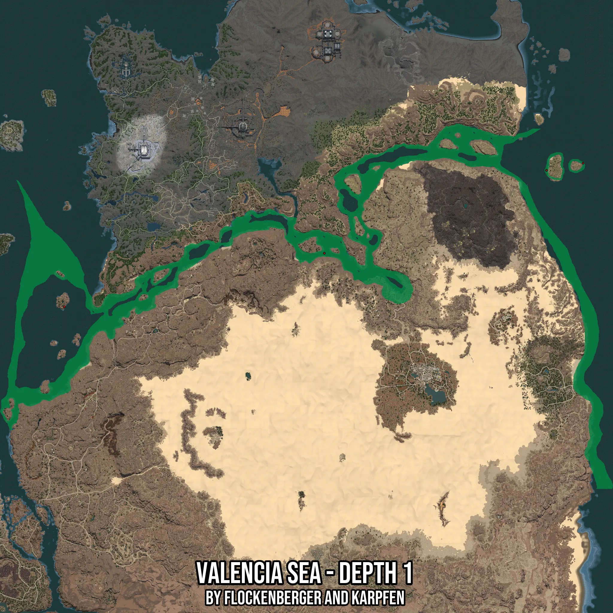

# Valencia Sea - Depth 1
Created by **flockenberger**

- **Red Points**: Exact in-game waypoints.
- **Colored Areas**: Entire area where the fishing table is consistent.
## ⚠️ Info about your float:
To verify your fishing position without modifying your files, you can do so [here](https://flockenberger.github.io/bdo-fish-position/).
- Or watch the guide [here](https://youtu.be/t-VXcRoNojk)

## Waypoints
Below you'll find the Copy-Paste ready XML file for this Fishing-Zone.

```xml
	<!--
		Waypoints for: Valencia Sea - Depth 1
		Auto-Generated by: flockenberger
		Preview at: https://github.com/Flockenberger/bdo-fish-waypoints/tree/main/Bookmark/Valencia%20Sea%20-%20Depth%201
	-->
	<WorldmapBookMark>
		<BookMark BookMarkName="1: Valencia Sea - Depth 1" PosX="859557.7039241791" PosY="-8175.0" PosZ="406889.3796682358" />
		<BookMark BookMarkName="2: Valencia Sea - Depth 1" PosX="1230607.1229457855" PosY="-8175.0" PosZ="545430.558848381" />
		<BookMark BookMarkName="3: Valencia Sea - Depth 1" PosX="1291745.9476709366" PosY="-8175.0" PosZ="557477.6179075241" />
		<BookMark BookMarkName="4: Valencia Sea - Depth 1" PosX="425261.22484207153" PosY="-8175.0" PosZ="317138.78967761993" />
		<BookMark BookMarkName="5: Valencia Sea - Depth 1" PosX="425562.4013185501" PosY="-8175.0" PosZ="317439.9661540985" />
	</WorldmapBookMark>
```

## Usage Guide
[](https://youtu.be/W-bWmKdv8K8)

## Previews
     

 