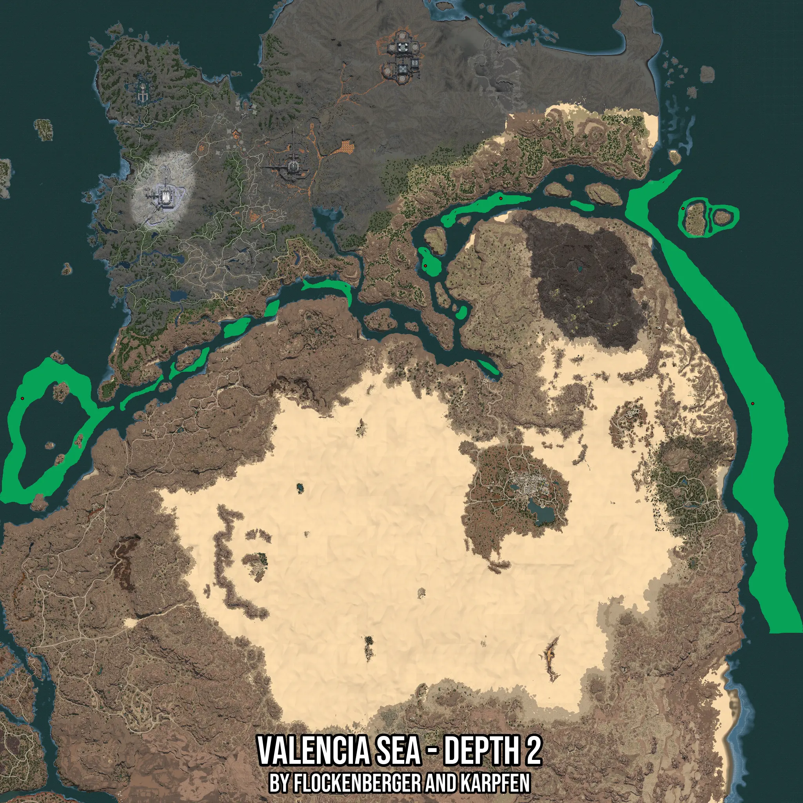

# Valencia Sea - Depth 2
Created by **flockenberger**

- **Red Points**: Exact in-game waypoints.
- **Colored Areas**: Entire area where the fishing table is consistent.
## ⚠️ Info about your float:
To verify your fishing position without modifying your files, you can do so [here](https://flockenberger.github.io/bdo-fish-position/).
- Or watch the guide [here](https://youtu.be/t-VXcRoNojk)

## Waypoints
Below you'll find the Copy-Paste ready XML file for this Fishing-Zone.

```xml
	<!--
		Waypoints for: Valencia Sea - Depth 2
		Auto-Generated by: flockenberger
		Preview at: https://github.com/Flockenberger/bdo-fish-waypoints/tree/main/Bookmark/Valencia%20Sea%20-%20Depth%202
	-->
	<WorldmapBookMark>
		<BookMark BookMarkName="1: Valencia Sea - Depth 2" PosX="1319153.007030487" PosY="-8175.0" PosZ="311416.436624527" />
		<BookMark BookMarkName="2: Valencia Sea - Depth 2" PosX="372254.16498184204" PosY="-8175.0" PosZ="318042.31910705566" />
		<BookMark BookMarkName="3: Valencia Sea - Depth 2" PosX="992677.70652771" PosY="-8175.0" PosZ="577355.2653551102" />
		<BookMark BookMarkName="4: Valencia Sea - Depth 2" PosX="1228800.064086914" PosY="-8175.0" PosZ="564404.6768665314" />
		<BookMark BookMarkName="5: Valencia Sea - Depth 2" PosX="894795.3516721725" PosY="-8175.0" PosZ="490014.08717632294" />
	</WorldmapBookMark>
```

## Usage Guide
[](https://youtu.be/W-bWmKdv8K8)

## Previews
     

 