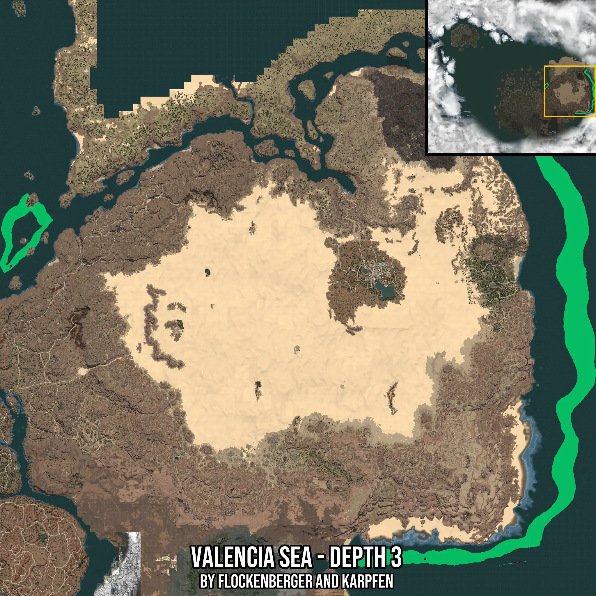

# Valencia Sea - Depth 3
Created by **flockenberger**

- **Red Points**: Exact in-game waypoints.
- **Colored Areas**: Entire area where the fishing table is consistent.
## ⚠️ Info about your float:
To verify your fishing position without modifying your files, you can do so [here](https://flockenberger.github.io/bdo-fish-position/).
- Or watch the guide [here](https://youtu.be/t-VXcRoNojk)

## Waypoints
Below you'll find the Copy-Paste ready XML file for this Fishing-Zone.

```xml
	<!--
		Waypoints for: Valencia Sea - Depth 3
		Auto-Generated by: flockenberger
		Preview at: https://github.com/Flockenberger/bdo-fish-waypoints/tree/main/Bookmark/Valencia%20Sea%20-%20Depth%203
	-->
	<WorldmapBookMark>
		<BookMark BookMarkName="1: Valencia Sea - Depth 3" PosX="1397760.0673913956" PosY="-8175.0" PosZ="284310.5537414551" />
		<BookMark BookMarkName="2: Valencia Sea - Depth 3" PosX="393637.694811821" PosY="-8175.0" PosZ="313223.49548339844" />
		<BookMark BookMarkName="3: Valencia Sea - Depth 3" PosX="410202.4010181427" PosY="-8175.0" PosZ="236122.3175048828" />
		<BookMark BookMarkName="4: Valencia Sea - Depth 3" PosX="377374.16508197784" PosY="-8175.0" PosZ="270757.6122999191" />
		<BookMark BookMarkName="5: Valencia Sea - Depth 3" PosX="377976.518034935" PosY="-8175.0" PosZ="263830.55334091187" />
	</WorldmapBookMark>
```

## Usage Guide
[](https://youtu.be/W-bWmKdv8K8)

## Previews
     

 