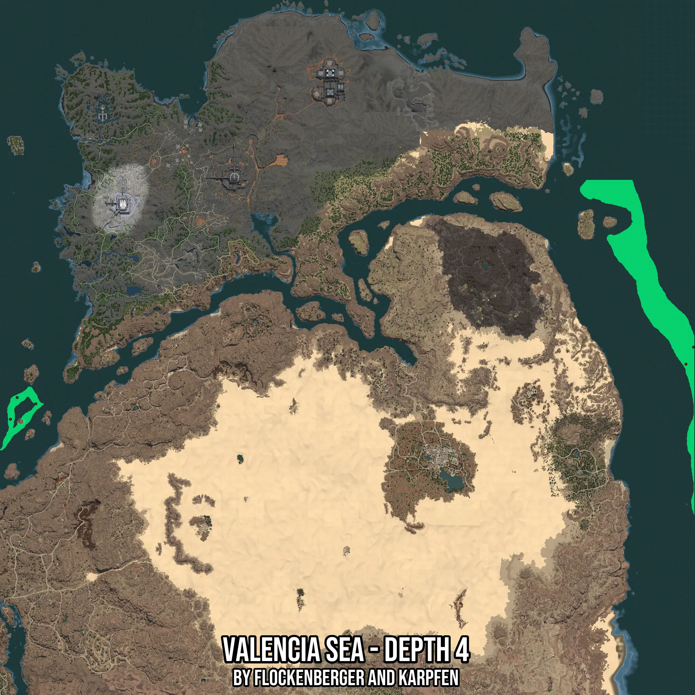

# Valencia Sea - Depth 4
Created by **flockenberger**

- **Red Points**: Exact in-game waypoints.
- **Colored Areas**: Entire area where the fishing table is consistent.
## ⚠️ Info about your float:
To verify your fishing position without modifying your files, you can do so [here](https://flockenberger.github.io/bdo-fish-position/).
- Or watch the guide [here](https://youtu.be/t-VXcRoNojk)

## Waypoints
Below you'll find the Copy-Paste ready XML file for this Fishing-Zone.

```xml
	<!--
		Waypoints for: Valencia Sea - Depth 4
		Auto-Generated by: flockenberger
		Preview at: https://github.com/Flockenberger/bdo-fish-waypoints/tree/main/Bookmark/Valencia%20Sea%20-%20Depth%204
	-->
	<WorldmapBookMark>
		<BookMark BookMarkName="1: Valencia Sea - Depth 4" PosX="1392640.0672912598" PosY="-8175.0" PosZ="342136.4372253418" />
		<BookMark BookMarkName="2: Valencia Sea - Depth 4" PosX="401769.45967674255" PosY="-8175.0" PosZ="292743.4950828552" />
		<BookMark BookMarkName="3: Valencia Sea - Depth 4" PosX="391830.6359529495" PosY="-8175.0" PosZ="260517.61209964752" />
		<BookMark BookMarkName="4: Valencia Sea - Depth 4" PosX="429477.6955127716" PosY="-8175.0" PosZ="283407.02431201935" />
		<BookMark BookMarkName="5: Valencia Sea - Depth 4" PosX="1403783.596920967" PosY="-8175.0" PosZ="367435.26124954224" />
	</WorldmapBookMark>
```

## Usage Guide
[](https://youtu.be/W-bWmKdv8K8)

## Previews
     

 