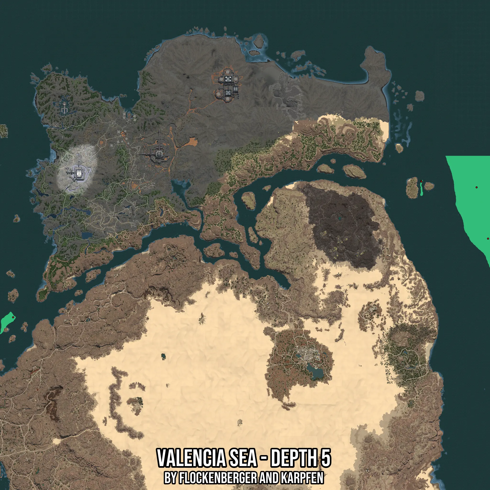

# Valencia Sea - Depth 5
Created by **flockenberger**

- **Red Points**: Exact in-game waypoints.
- **Colored Areas**: Entire area where the fishing table is consistent.
## ⚠️ Info about your float:
To verify your fishing position without modifying your files, you can do so [here](https://flockenberger.github.io/bdo-fish-position/).
- Or watch the guide [here](https://youtu.be/t-VXcRoNojk)

## Waypoints
Below you'll find the Copy-Paste ready XML file for this Fishing-Zone.

```xml
	<!--
		Waypoints for: Valencia Sea - Depth 5
		Auto-Generated by: flockenberger
		Preview at: https://github.com/Flockenberger/bdo-fish-waypoints/tree/main/Bookmark/Valencia%20Sea%20-%20Depth%205
	-->
	<WorldmapBookMark>
		<BookMark BookMarkName="1: Valencia Sea - Depth 5" PosX="1401073.00863266" PosY="-8175.0" PosZ="444536.43922805786" />
		<BookMark BookMarkName="2: Valencia Sea - Depth 5" PosX="422550.63655376434" PosY="-8175.0" PosZ="282503.4948825836" />
		<BookMark BookMarkName="3: Valencia Sea - Depth 5" PosX="1263435.3588819504" PosY="-8175.0" PosZ="563501.1474370956" />
		<BookMark BookMarkName="4: Valencia Sea - Depth 5" PosX="1264037.7118349075" PosY="-8175.0" PosZ="561995.2650547028" />
		<BookMark BookMarkName="5: Valencia Sea - Depth 5" PosX="1377581.243467331" PosY="-8175.0" PosZ="550249.3824720383" />
	</WorldmapBookMark>
```

## Usage Guide
[](https://youtu.be/W-bWmKdv8K8)

## Previews
     

 