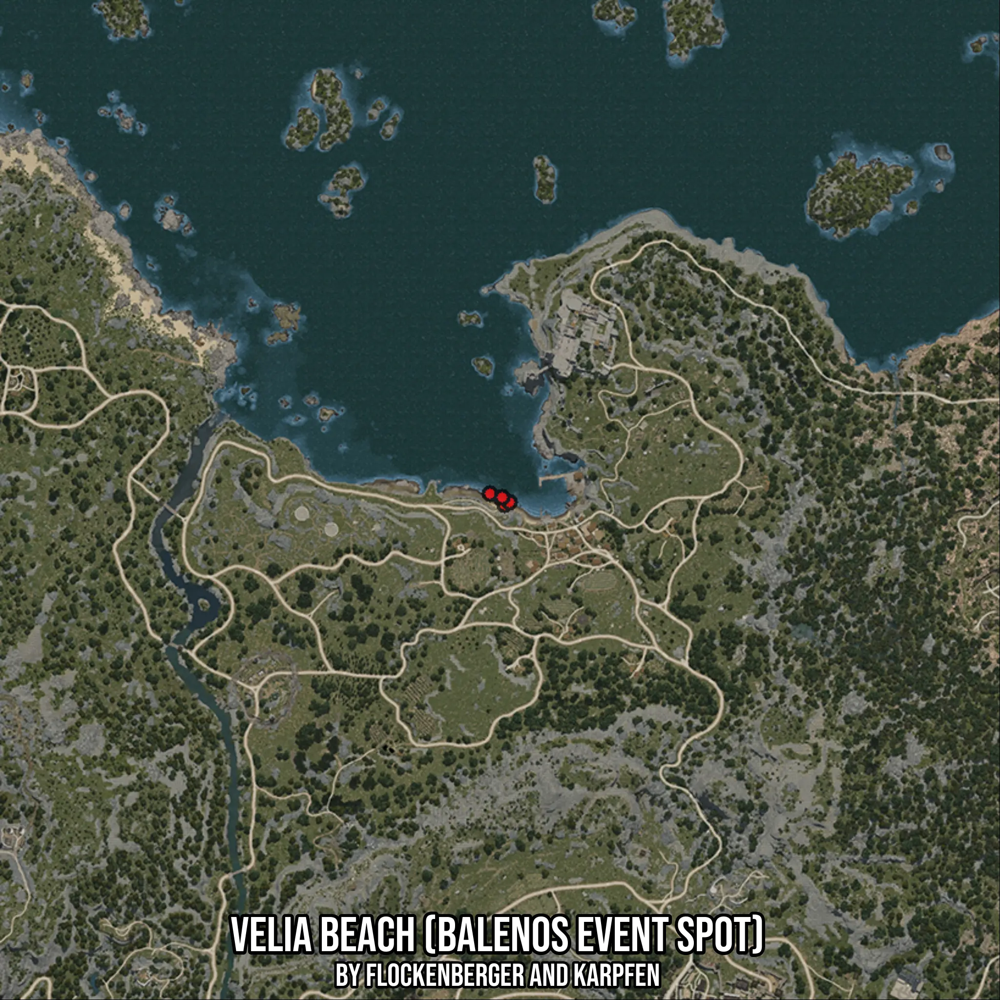

# Velia Beach (Balenos Event Spot)
Created by **flockenberger**

- **Red Points**: Exact in-game waypoints.
- **Colored Areas**: Entire area where the fishing table is consistent.
## ⚠️ Info about your float:
To verify your fishing position without modifying your files, you can do so [here](https://flockenberger.github.io/bdo-fish-position/).
- Or watch the guide [here](https://youtu.be/t-VXcRoNojk)

## Waypoints
Below you'll find the Copy-Paste ready XML file for this Fishing-Zone.

```xml
	<!--
		Waypoints for: Velia Beach (Balenos Event Spot)
		Auto-Generated by: flockenberger
		Preview at: https://github.com/Flockenberger/bdo-fish-waypoints/tree/main/Bookmark/Velia%20Beach%20(Balenos%20Event%20Spot)
	-->
	<WorldmapBookMark>
		<BookMark BookMarkName="1: Velia Beach (Balenos Event Spot)" PosX="-3011.7247104644775" PosY="-8175.0" PosZ="88244.66755390167" />
		<BookMark BookMarkName="2: Velia Beach (Balenos Event Spot)" PosX="-2409.371757507324" PosY="-8175.0" PosZ="87039.96164798737" />
		<BookMark BookMarkName="3: Velia Beach (Balenos Event Spot)" PosX="-6023.489475250244" PosY="-8175.0" PosZ="89750.54993629456" />
		<BookMark BookMarkName="4: Velia Beach (Balenos Event Spot)" PosX="-1204.6658515930176" PosY="-8175.0" PosZ="87642.31460094452" />
		<BookMark BookMarkName="5: Velia Beach (Balenos Event Spot)" PosX="-3011.7247104644775" PosY="-8175.0" PosZ="88847.02050685883" />
	</WorldmapBookMark>
```

## Usage Guide
[](https://youtu.be/W-bWmKdv8K8)

## Previews
     

 