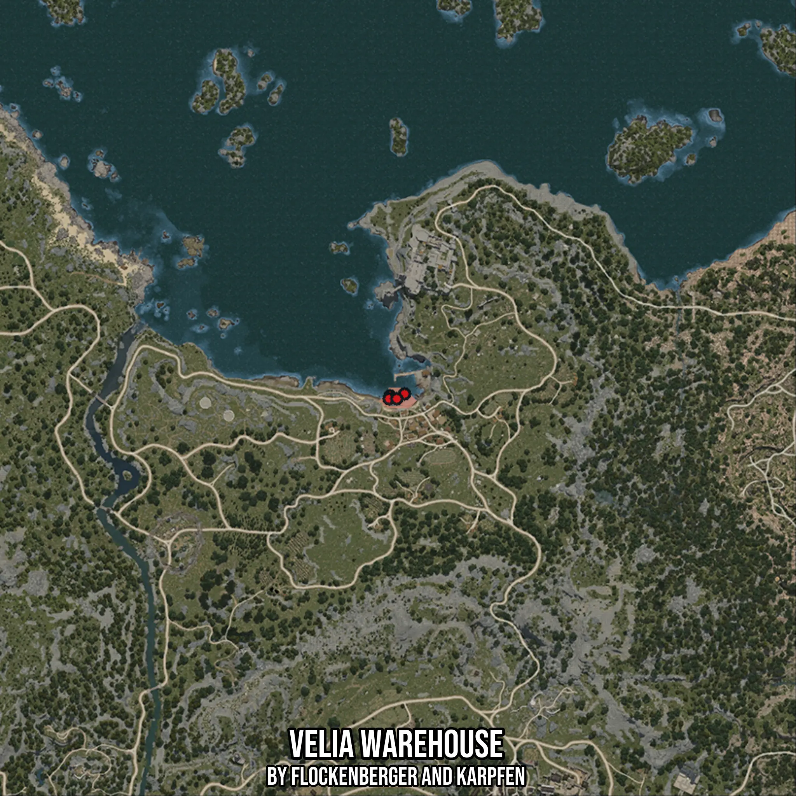

# Velia Warehouse
Created by **flockenberger**

- **Red Points**: Exact in-game waypoints.
- **Colored Areas**: Entire area where the fishing table is consistent.
## ⚠️ Info about your float:
To verify your fishing position without modifying your files, you can do so [here](https://flockenberger.github.io/bdo-fish-position/).
- Or watch the guide [here](https://youtu.be/t-VXcRoNojk)

## Waypoints
Below you'll find the Copy-Paste ready XML file for this Fishing-Zone.

```xml
	<!--
		Waypoints for: Velia Warehouse
		Auto-Generated by: flockenberger
		Preview at: https://github.com/Flockenberger/bdo-fish-waypoints/tree/main/Bookmark/Velia%20Warehouse
	-->
	<WorldmapBookMark>
		<BookMark BookMarkName="1: Velia Warehouse" PosX="5421.216630935669" PosY="-8175.0" PosZ="86437.60869503021" />
		<BookMark BookMarkName="2: Velia Warehouse" PosX="4818.863677978516" PosY="-8175.0" PosZ="87039.96164798737" />
		<BookMark BookMarkName="3: Velia Warehouse" PosX="4517.687201499939" PosY="-8175.0" PosZ="86136.43221855164" />
		<BookMark BookMarkName="4: Velia Warehouse" PosX="9336.510825157166" PosY="-8175.0" PosZ="87642.31460094452" />
		<BookMark BookMarkName="5: Velia Warehouse" PosX="6927.099013328552" PosY="-8175.0" PosZ="86136.43221855164" />
	</WorldmapBookMark>
```

## Usage Guide
[](https://youtu.be/W-bWmKdv8K8)

## Previews
     

 