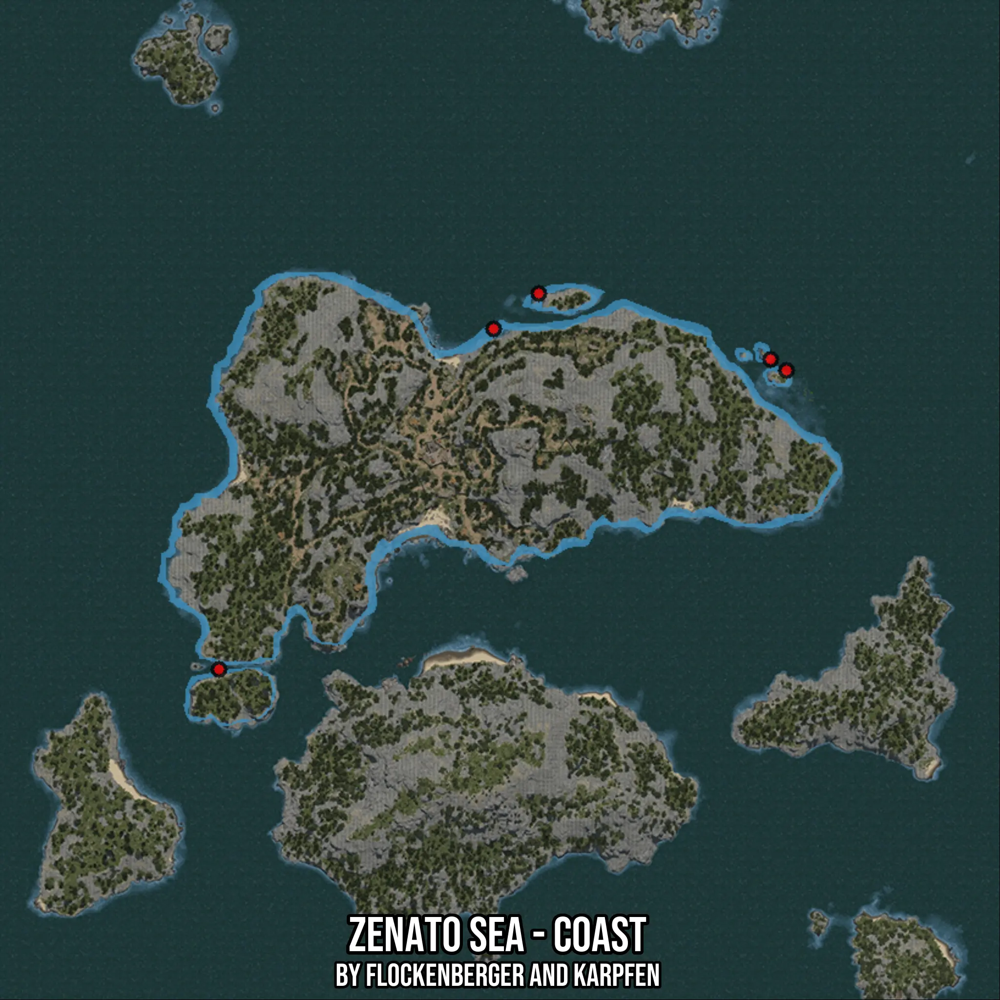

# Zenato Sea - Coast
Created by **flockenberger**

- **Red Points**: Exact in-game waypoints.
- **Colored Areas**: Entire area where the fishing table is consistent.
## ⚠️ Info about your float:
To verify your fishing position without modifying your files, you can do so [here](https://flockenberger.github.io/bdo-fish-position/).
- Or watch the guide [here](https://youtu.be/t-VXcRoNojk)

## Waypoints
Below you'll find the Copy-Paste ready XML file for this Fishing-Zone.

```xml
	<!--
		Waypoints for: Zenato Sea - Coast
		Auto-Generated by: flockenberger
		Preview at: https://github.com/Flockenberger/bdo-fish-waypoints/tree/main/Bookmark/Zenato%20Sea%20-%20Coast
	-->
	<WorldmapBookMark>
		<BookMark BookMarkName="1: Zenato Sea - Coast" PosX="-334908.20178985596" PosY="-8175.0" PosZ="426465.85063934326" />
		<BookMark BookMarkName="2: Zenato Sea - Coast" PosX="-323764.6721601486" PosY="-8175.0" PosZ="435199.968457222" />
		<BookMark BookMarkName="3: Zenato Sea - Coast" PosX="-402672.9089975357" PosY="-8175.0" PosZ="342437.6137018204" />
		<BookMark BookMarkName="4: Zenato Sea - Coast" PosX="-262625.84743499756" PosY="-8175.0" PosZ="416225.85043907166" />
		<BookMark BookMarkName="5: Zenato Sea - Coast" PosX="-266541.14162921906" PosY="-8175.0" PosZ="418936.43872737885" />
	</WorldmapBookMark>
```

## Usage Guide
[](https://youtu.be/W-bWmKdv8K8)

## Previews
     

 