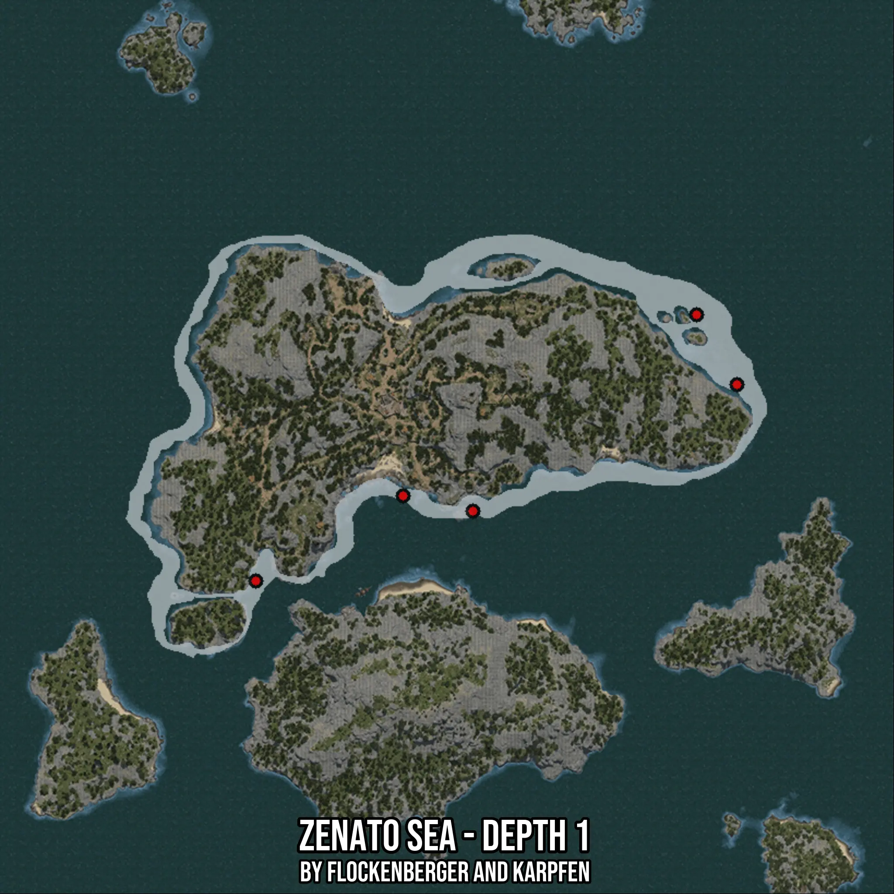

# Zenato Sea - Depth 1
Created by **flockenberger**

- **Red Points**: Exact in-game waypoints.
- **Colored Areas**: Entire area where the fishing table is consistent.
## ⚠️ Info about your float:
To verify your fishing position without modifying your files, you can do so [here](https://flockenberger.github.io/bdo-fish-position/).
- Or watch the guide [here](https://youtu.be/t-VXcRoNojk)

## Waypoints
Below you'll find the Copy-Paste ready XML file for this Fishing-Zone.

```xml
	<!--
		Waypoints for: Zenato Sea - Depth 1
		Auto-Generated by: flockenberger
		Preview at: https://github.com/Flockenberger/bdo-fish-waypoints/tree/main/Bookmark/Zenato%20Sea%20-%20Depth%201
	-->
	<WorldmapBookMark>
		<BookMark BookMarkName="1: Zenato Sea - Depth 1" PosX="-345449.37846660614" PosY="-8175.0" PosZ="370748.2024908066" />
		<BookMark BookMarkName="2: Zenato Sea - Depth 1" PosX="-386108.202791214" PosY="-8175.0" PosZ="347256.4373254776" />
		<BookMark BookMarkName="3: Zenato Sea - Depth 1" PosX="-326174.08397197723" PosY="-8175.0" PosZ="366531.7318201065" />
		<BookMark BookMarkName="4: Zenato Sea - Depth 1" PosX="-253289.37666416168" PosY="-8175.0" PosZ="401468.2030916214" />
		<BookMark BookMarkName="5: Zenato Sea - Depth 1" PosX="-264432.906293869" PosY="-8175.0" PosZ="420743.4975862503" />
	</WorldmapBookMark>
```

## Usage Guide
[](https://youtu.be/W-bWmKdv8K8)

## Previews
     

 