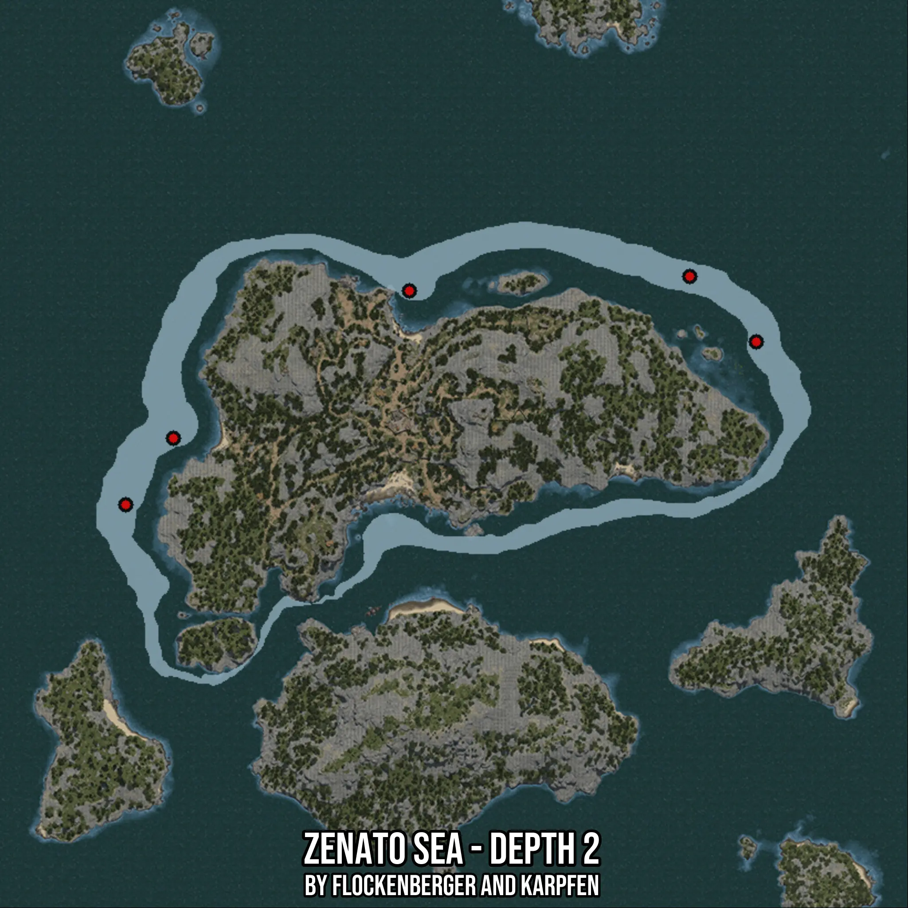

# Zenato Sea - Depth 2
Created by **flockenberger**

- **Red Points**: Exact in-game waypoints.
- **Colored Areas**: Entire area where the fishing table is consistent.
## ⚠️ Info about your float:
To verify your fishing position without modifying your files, you can do so [here](https://flockenberger.github.io/bdo-fish-position/).
- Or watch the guide [here](https://youtu.be/t-VXcRoNojk)

## Waypoints
Below you'll find the Copy-Paste ready XML file for this Fishing-Zone.

```xml
	<!--
		Waypoints for: Zenato Sea - Depth 2
		Auto-Generated by: flockenberger
		Preview at: https://github.com/Flockenberger/bdo-fish-waypoints/tree/main/Bookmark/Zenato%20Sea%20-%20Depth%202
	-->
	<WorldmapBookMark>
		<BookMark BookMarkName="1: Zenato Sea - Depth 2" PosX="-346654.08437252045" PosY="-8175.0" PosZ="431284.6742630005" />
		<BookMark BookMarkName="2: Zenato Sea - Depth 2" PosX="-423755.2623510361" PosY="-8175.0" PosZ="373157.6143026352" />
		<BookMark BookMarkName="3: Zenato Sea - Depth 2" PosX="-410804.6738624573" PosY="-8175.0" PosZ="391228.2028913498" />
		<BookMark BookMarkName="4: Zenato Sea - Depth 2" PosX="-270456.43582344055" PosY="-8175.0" PosZ="435199.968457222" />
		<BookMark BookMarkName="5: Zenato Sea - Depth 2" PosX="-252385.84723472595" PosY="-8175.0" PosZ="417430.55634498596" />
	</WorldmapBookMark>
```

## Usage Guide
[](https://youtu.be/W-bWmKdv8K8)

## Previews
     

 