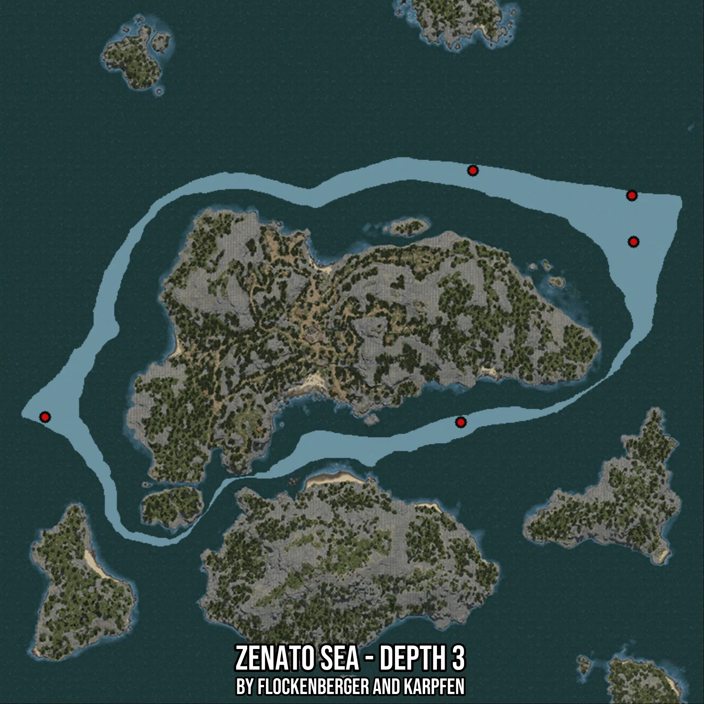

# Zenato Sea - Depth 3
Created by **flockenberger**

- **Red Points**: Exact in-game waypoints.
- **Colored Areas**: Entire area where the fishing table is consistent.
## ⚠️ Info about your float:
To verify your fishing position without modifying your files, you can do so [here](https://flockenberger.github.io/bdo-fish-position/).
- Or watch the guide [here](https://youtu.be/t-VXcRoNojk)

## Waypoints
Below you'll find the Copy-Paste ready XML file for this Fishing-Zone.

```xml
	<!--
		Waypoints for: Zenato Sea - Depth 3
		Auto-Generated by: flockenberger
		Preview at: https://github.com/Flockenberger/bdo-fish-waypoints/tree/main/Bookmark/Zenato%20Sea%20-%20Depth%203
	-->
	<WorldmapBookMark>
		<BookMark BookMarkName="1: Zenato Sea - Depth 3" PosX="-237929.37636375427" PosY="-8175.0" PosZ="444536.43922805786" />
		<BookMark BookMarkName="2: Zenato Sea - Depth 3" PosX="-293647.02451229095" PosY="-8175.0" PosZ="453270.5570459366" />
		<BookMark BookMarkName="3: Zenato Sea - Depth 3" PosX="-297863.495182991" PosY="-8175.0" PosZ="365025.8494377136" />
		<BookMark BookMarkName="4: Zenato Sea - Depth 3" PosX="-237327.02341079712" PosY="-8175.0" PosZ="428272.9094982147" />
		<BookMark BookMarkName="5: Zenato Sea - Depth 3" PosX="-443632.90979862213" PosY="-8175.0" PosZ="366832.9082965851" />
	</WorldmapBookMark>
```

## Usage Guide
[](https://youtu.be/W-bWmKdv8K8)

## Previews
     

 