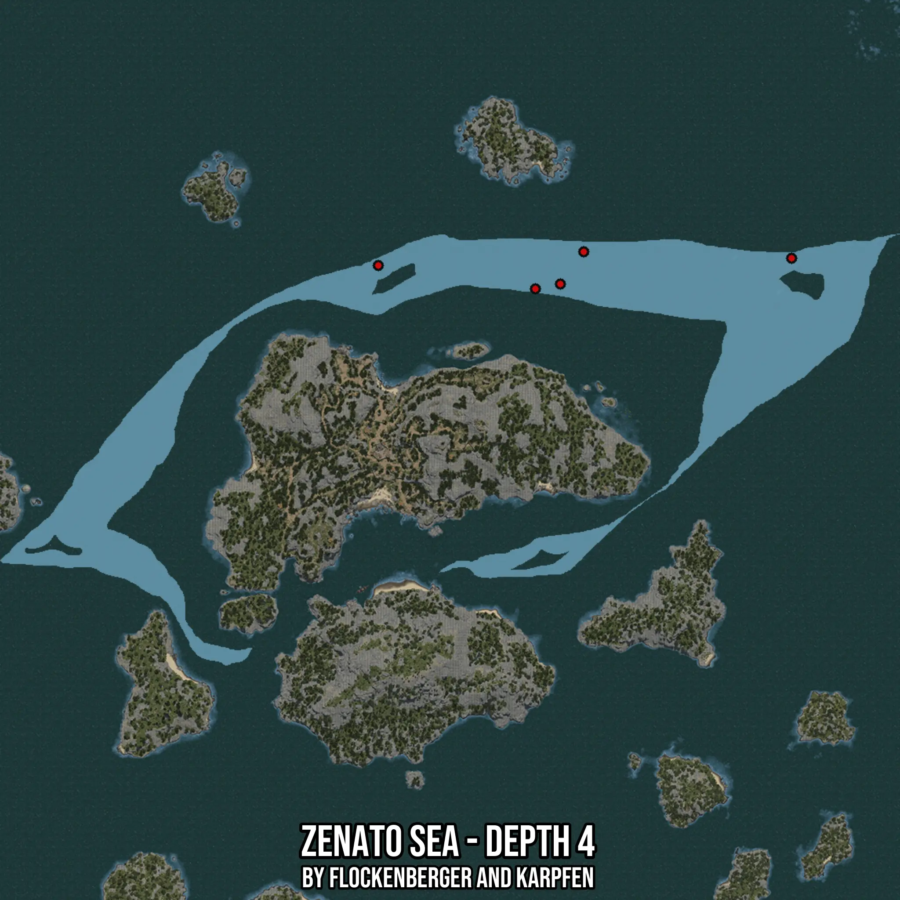

# Zenato Sea - Depth 4
Created by **flockenberger**

- **Red Points**: Exact in-game waypoints.
- **Colored Areas**: Entire area where the fishing table is consistent.
## ⚠️ Info about your float:
To verify your fishing position without modifying your files, you can do so [here](https://flockenberger.github.io/bdo-fish-position/).
- Or watch the guide [here](https://youtu.be/t-VXcRoNojk)

## Waypoints
Below you'll find the Copy-Paste ready XML file for this Fishing-Zone.

```xml
	<!--
		Waypoints for: Zenato Sea - Depth 4
		Auto-Generated by: flockenberger
		Preview at: https://github.com/Flockenberger/bdo-fish-waypoints/tree/main/Bookmark/Zenato%20Sea%20-%20Depth%204
	-->
	<WorldmapBookMark>
		<BookMark BookMarkName="1: Zenato Sea - Depth 4" PosX="-291839.9656534195" PosY="-8175.0" PosZ="456583.4982872009" />
		<BookMark BookMarkName="2: Zenato Sea - Depth 4" PosX="-282503.4948825836" PosY="-8175.0" PosZ="458390.5571460724" />
		<BookMark BookMarkName="3: Zenato Sea - Depth 4" PosX="-196065.84613323212" PosY="-8175.0" PosZ="468028.20439338684" />
		<BookMark BookMarkName="4: Zenato Sea - Depth 4" PosX="-350569.37856674194" PosY="-8175.0" PosZ="465317.61610507965" />
		<BookMark BookMarkName="5: Zenato Sea - Depth 4" PosX="-273769.3770647049" PosY="-8175.0" PosZ="470437.61620521545" />
	</WorldmapBookMark>
```

## Usage Guide
[](https://youtu.be/W-bWmKdv8K8)

## Previews
     

 