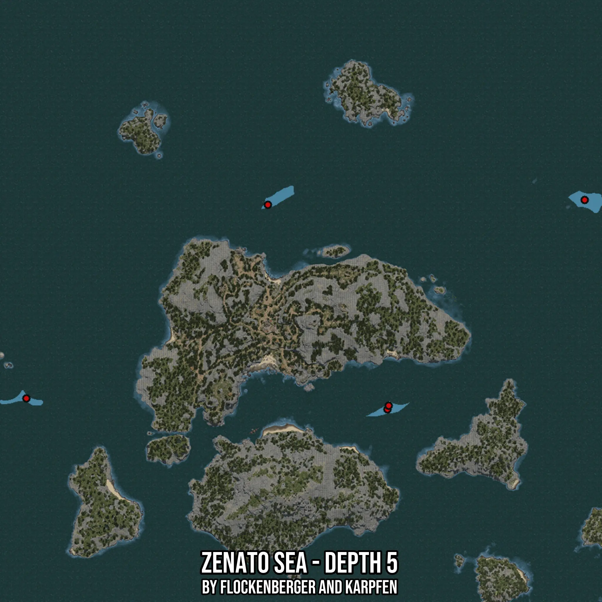

# Zenato Sea - Depth 5
Created by **flockenberger**

- **Red Points**: Exact in-game waypoints.
- **Colored Areas**: Entire area where the fishing table is consistent.
## ⚠️ Info about your float:
To verify your fishing position without modifying your files, you can do so [here](https://flockenberger.github.io/bdo-fish-position/).
- Or watch the guide [here](https://youtu.be/t-VXcRoNojk)

## Waypoints
Below you'll find the Copy-Paste ready XML file for this Fishing-Zone.

```xml
	<!--
		Waypoints for: Zenato Sea - Depth 5
		Auto-Generated by: flockenberger
		Preview at: https://github.com/Flockenberger/bdo-fish-waypoints/tree/main/Bookmark/Zenato%20Sea%20-%20Depth%205
	-->
	<WorldmapBookMark>
		<BookMark BookMarkName="1: Zenato Sea - Depth 5" PosX="-192451.7284154892" PosY="-8175.0" PosZ="458992.91009902954" />
		<BookMark BookMarkName="2: Zenato Sea - Depth 5" PosX="-349665.8491373062" PosY="-8175.0" PosZ="456583.4982872009" />
		<BookMark BookMarkName="3: Zenato Sea - Depth 5" PosX="-290334.0832710266" PosY="-8175.0" PosZ="355087.0257139206" />
		<BookMark BookMarkName="4: Zenato Sea - Depth 5" PosX="-469534.0867757797" PosY="-8175.0" PosZ="360508.202290535" />
		<BookMark BookMarkName="5: Zenato Sea - Depth 5" PosX="-289731.73031806946" PosY="-8175.0" PosZ="356894.08457279205" />
	</WorldmapBookMark>
```

## Usage Guide
[](https://youtu.be/W-bWmKdv8K8)

## Previews
     

 