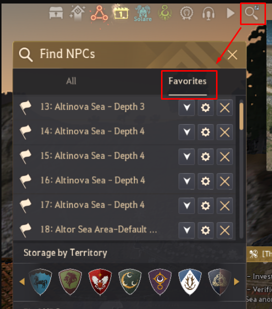

# Fishing Waypoints for Black Desert Online

Files generated by **flockenberger**.

These waypoints were generated by using blob detection on the original fishing bitmap 
which you can find on [BDOLytics](https://bdolytics.com/en/EU/map).

Instead of using the centroid of the detected area, a **random point** within the detected area was selected as the waypoint. Only the **first four detected points** (sorted by descending size) were included.

The names of the bookmarks were taken from the original translation of the leaked datasheet from way back when.
Newer regions are marked as "Unknown_Zone_XXX" (I am very creative :) ) and is basically any region added after 2019.

As another side-note:
`All Y positions are set to 0!`
If you encounter specific problems with it lmk.`

## Usage
1. Navigate to the `/Bookmark` directory where you will find the fishing waypoint files.
2. Optionally, use the `Preview.png` file to view:
    - **Green Points**: Exact in-game waypoints.
    - **Red Areas**: Entire areas where the fishing table is consistent.
3. Close the game. Otherwise it will overwrite the bookmark file when closing.
4. Copy the `worldMapBookMark.data` file into your: `\Documents\Black Desert\UserCache\USERNAME`
    - **Make sure to make a copy of your old `worldMapBookMark.data` if you still need it later!**
5. Start BDO and access the waypoints through the Find NPCs Menu in the Favorites tab.

Once you have done that you should be able to see the waypoints in your favorites like below

## Disclaimer
I am not responsible for any **Terms of Service violations** or **account penalties** that may result from the use of these files. Use them at your own discretion.

---

Enjoy enhanced fishing in Black Desert Online! 🎣
